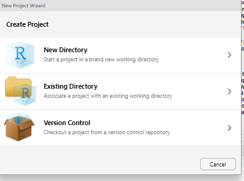

<!--TODO: If you use this header, update to your repository URL-->

<h1 align="center">
  <br>
    <a href="https://medicine.exeter.ac.uk/phss/research/pentag/"></a>
  <br>
  Exeter Oncology Model: Renal Cell Carcinoma edition
  <br>
</h1>

<p align="center">
  <i align="center">Produced as part of NICE's pathways pilot</i>
</p>

<!--I've used HTML for badges as this allows them to be centered and default to open in new tab.

TODO: If you use the badges, update to your repository URL where relevant-->

<p align="center">
    <a target="_blank" href="https://doi.org/10.5281/zenodo.13969124"></a>
    <a target="_blank" href="https://www.r-project.org/"></a>
    <a href="#"></a>
    <a href="#"></a>
    <a href="#"></a>
    <a target="_blank" href="https://github.com/pythonhealthdatascience/stars-eom-rcc/blob/main/LICENSE"></a>
</p>

## Table of contents

* [💻 Documentation](#-documentation)
* [🌐 Web Application](#-web-application)
* [📊 About the model](#-about-the-model)
* [🔨 Installation](#-installation)
* [🚀 Running the model](#-running-the-model)
* [🔧 Varying model parameters](#-varying-model-parameters)
* [📂 Repository overview](#-repository-overview)
* [🐙 GitHub actions](#-github-actions)
* [📝 Citation](#-citation)
* [🧍 Acknowledgements](#-acknowledgements)
* [📜 License](#-license)
* [💰 Funding](#-funding)
* [🔜 Future versions](#-future-versions)

<br><br>

## 💻 Documentation

This **README** provides an introduction to the model and how to run the code in this repository. If you would prefer to read a **word document** for instructions on using the model, please refer to `ID6184 Using the R decision model (EAG instructions) noACIC 30.07.2024.docx`.

It is recommended that you also referred to the more **detailed documentation** available at:

**<https://pythonhealthdatascience.github.io/stars-eom-rcc/>**

This website provides:

* Acronyms
* Context on the associated NICE appraisals, articles and reports
* A detailed summary of the analysis
* A plain english summary of the analysis
* Installation instructions
* A step-by-step walkthrough of the code in `Model_Structure.R`
* Descriptions of the probabilistic analysis and scenario analysis
* Details about the license, citation instructions and the changelog

<br>

<a href="https://pythonhealthdatascience.github.io/stars-eom-rcc/"></a>

<br><br>

## 🌐 Web Application

The ambition for EOM:RCC is to create a shiny interface that allows users to interact and run the full economic model from a web application. A **pilot example** web app has been created which allows users to run one part of the analysis: creating a table of possible treatment sequences. The code for this is in `shinyapp/`, and the app can be viewed online at:

**<https://amyheather.shinyapps.io/shinyapp/>**

<br>

<a href="https://amyheather.shinyapps.io/shinyapp/"></a>

<a href="https://amyheather.shinyapps.io/shinyapp/"></a>

<br><br>

## 📊 About the model

The **Exeter Oncology Model: Renal Cell Carcinoma edition (EOM-RCC)** is a platform cost-effectiveness model encompassing each decision node in the disease area for advanced renal cell carcinoma. It has been constructed as part of:

> National Institute for Health and Care Excellence (NICE). **Renal cell carcinoma Pathways Pilot [ID6186]**. In development [GID-TA11186]. <https://www.nice.org.uk/guidance/indevelopment/gid-ta11186>.
>
> National Institute for Health and Care Excellence (NICE). **Cabozantinib with nivolumab for untreated advanced renal cell carcinoma. Technology appraisal guidance [TA964]**. <https://www.nice.org.uk/guidance/ta964>

The Pathways Pilot aims both at reducing the long-term resource requirements for appraisal within crowded treatment pathways and at assessing the feasibility of incorporating treatment sequences into decision making. The development of this model is described in the publication:

> Lee, D., Burns, D. & Wilson, E. **NICE’s Pathways Pilot: Pursuing Good Decision Making in Difficult Circumstances**. PharmacoEconomics Open (2024). <https://doi.org/10.1007/s41669-024-00490-x>.

R was ideal for this model due to its ability to handle the extensive computations required. With 744 potential treatment sequences across various populations, the model efficiently executed block-diagonal sparse matrix multiplications for sequencing calculations. This would be infeasible to implement efficiently in Excel.

Unfortunately, we were not able to add a graphical user-interface in the timeframes available for the model build; instead, we built the front-end in Excel allowing the stakeholders a familiar and flexible means to interact with it. 

No data is contained in the code. All input data is contained in the data folder, dummy data is provided where the data used in the appraisal was marked as confidential. The model extracts all inputs directly from Excel, separating all sensitive data and inputs from the code. Consequently, no confidential information is contained in the code.

<br><br>

## 🔨 Installation

To install and run this model, you will need to have the following on your machine:

[](https://www.r-project.org/)
[](https://posit.co/download/rstudio-desktop/)
[](https://cran.r-project.org/bin/windows/Rtools/)
[](https://git-scm.com/)

There are a few options for installing this model.

<details markdown="1">
<summary><b>Accessing the code via Git (version control)</b></summary>

To access the model using Git the easiest method is to create a new project in RStudio which links to the NICE github website. Simply click `New Project` in the right hand of your RStudio screen:


Then select `Version Control`:



Then choose `Git`:


Paste in the URL of the NICE repository (<https://github.com/nice-digital/NICE-model-repo>) in the repository URL and decide where you want the project to be saved on your computer using the `Browse` functionality. All of your team can access the code then in the same way.

If there is more than one branch of code available as the model is updated you can select what branch of the code to look at on the top right of your screen.


</details>

<details markdown="1">
<summary><b>Accessing the code by downloading the model</b></summary>

If you do not wish to access the model via Git you can instead download the code and run the model on your local machine either using RStudio or R.

To do this click the `Code` button and then `Download ZIP`:


Extract the zip file to wherever on your machine you want to store the model. We would suggest saving it somewhere other than the `Downloads/` folder. Open RStudio and press `File` then `New Project`:


Click `Existing Directory`:


Click on the folder where you have saved the model. Make sure you click fully through until you can see the sub folders. Then press `Open` and then `Create Project`.


</details>

You'll also need to install the model dependencies. Your options for this include:

<details markdown="1">
<summary><b>Installing into current environment</b></summary>

In `Model_Structure.R`, lines 6 to 28 contain instructions for installing the relevant packages. You can use `ctrl+shift+c` to uncomment these lines and `ctrl+enter` to run a line or a group of highlighted lines. You only need to do this once and then should recomment the lines using `ctrl+shift+c`.

This will install the packages into your current environment. If you want to create an isolated environment to install these packages into, then you can set up an R environment with `renv` by running:

```
install.packages("renv")
renv::init()
```

Install your packages as above, and then keep a record of what you installed by running:

```
renv::snapshot()
```

</details>

<details markdown="1">
<summary><b>Restoring provided `renv`</b></summary>

We have created an R environment with all the required packages and the versions we used. You can see the version of R this was set up with in the `renv.lock` file. To install the dependencies by copying this environment, run the following commands in your R console:

```
install.packages("renv")
renv::restore()
```

</details>

<br><br>

## 🚀 Running the model

The main model script is `Model_Structure.R`. You can run this by clicking the `source` button, pressing `ctrl+shift+S`, or running the following in your R console:

```
source("2_Scripts/Model_Structure.R", echo=TRUE)
```

You can run parts of the model by highlighting sections of code and using `ctrl+enter`.

Further information about the model:

<details markdown="1">
<summary><b>What happens when the model runs?</b></summary>

When run, the model will:

* Extract cost, resource use, utility, relative effectiveness and treatment sequence settings inputs from Excel front-end
* Compute possible treatment sequences for each population
* Either load patient level data and conduct survival analyses or load the pre-run survival analysis
* Load network meta-analyses
* Populate and propagate relative efficacy network for all treatments at all lines
* Compute patient flow for all possible sequences at all possible lines and apply cost and utility weights
* If you have set the model up to look at the cabo+nivo decision problem: compute weighted average patient flow by first-line treatment and calculate the impact of patient access schemes (confidential discounts on the published list price) in increments of 1 from 1 to 100% for all treatments
* Output results as files to store and as a fully automated Word document following formatting requirements for NICE

</details>

<details markdown="1">
<summary><b>Model structure</b></summary>

Previous appraisals in RCC highlighted issues with subsequent treatments in trials not being available in UK practice and difficulties in matching cost and effectiveness data when trying to compensate. Consequently, we built a state transition model with tunnel states to incorporate time-dependency at later lines. This approach simplified incorporation of the sequencing features which arose within the scope of the pilot. For prudence, we incorporated a partitioned-survival (PartSA) modelling approach in parallel. This allowed comparison with models following implementation precedent in advanced RCC evaluations.

You can change which model structure is run using the drop down menu on the Controls sheet in the Excel front end.

</details>

<details markdown="1">
<summary><b>Model run time</b></summary>

Most of the model run time is on the function `f_pf_computePF`. It will print to the console as it runs, and once complete, will have output:

```
ST model. Population 1	| Sequences: 'All risk and favourable risk no prior adjuvant'	 | 1L Risk: 'All risk', further lines assumed all population
M: pathways with 1 active treatment lines 
M: pathways with 2 active treatment lines                                                                    
M: pathways with 3 active treatment lines                                                                    
M: pathways with 4 active treatment lines                                                                    
ST model. Population 2	| Sequences: 'All risk and favourable risk no prior adjuvant'	 | 1L Risk: 'Favourable risk', further lines assumed all population
M: pathways with 1 active treatment lines 
M: pathways with 2 active treatment lines                                                                    
M: pathways with 3 active treatment lines                                                                    
M: pathways with 4 active treatment lines                                                                    
ST model. Population 3	| Sequences: 'Int / poor risk no prior adjuvant'	 | 1L Risk: 'Int/poor', further lines assumed all population
M: pathways with 1 active treatment lines 
M: pathways with 2 active treatment lines                                                                    
M: pathways with 3 active treatment lines                                                                    
M: pathways with 4 active treatment lines
Time difference of X mins
```

The run time for this was 40 minutes on an Intel Core i7-12700H with 32GB RAM running Ubuntu 22.04.4 Linux.

From `nice-digital/NICE-model-repo`, the "runtime for the full state transition model is around 90 processor-minutes. This simulates hundreds of treatment pathways for tens of thousands of health states for thousands of time cycles for each pathway. By contrast, the PartSA version of the model takes less than 5 minutes, though without addressing any of the issues of that approach". These times were from model runs on Intel Core u7-1165G7 with 32GB RAM running Windows.

</details>

<br><br>

## 🔧 Varying model parameters

If you would like to amend inputs you should do this in the Excel front end file. Use the cells and drop-down menus provided.

The way the model works is that inputs / tables which are named with “R_” are extracted by the R code and used to populate the R model. We would recommend the user avoid adding columns or rows to the Excel file as this may change the format of the tables being pulled into R in ways that break the code. Instead, please use the input cells provided.

By default, R will use inputs from `1_Data/ID6184_RCC_model inputs FAD version [UK RWE unredacted, ACIC redacted, cPAS redacted].xlsm`. If this file does not exist, it will ask you to select the file to use for inputs.

<details markdown="1">
<summary><b>Overview of input files</b></summary>

There are a number of files which contain raw or intermediate inputs, which are stored in `1_Data/`:

1. **Excel user interface** (`ID6184_RCC_model inputs FAD version [UK RWE unredacted, ACIC redacted, cPAS redacted].xlsm`): Contains user input sheets with different model inputs which feeds into R tables (named in excel as R_table…) and subsequently being read by the R program. The version available to the public does not contain confidential company data, confidential price discounts or company individual patient data and treatment sequence data. The model does now contain UK real-world evidence (RWE) data which was redacted at the time of the appraisal at the request of the UK real-world evidence (RWE) data holders.

2. **Proportional hazards NMA CODA RDS file** (`PH_NMA_CODA.rds`): Note the version of this using time to next treatment as a surrogate for nivolumab plus ipilimumab is not available to the public as this data was marked as confidential by the data holders. 

3. **Fractional polynomials NMA RDS file** (`FPNMA_means.rds`): Note the version of this using time to next treatment as a surrogate for nivolumab plus ipilimumab is not available to the public as this data was marked as confidential by the data holders. 

4. **Raw data file containing the pseudo-IPD for all trials for survival analysis** (`IPD_R_input_noACIC.xlsx`): Note in the publicly available version data has been simulated to replaced data considered confidential by either the UK RWE dataholders or involved companies; or

5. **RDS output from the survival analysis using company data** (`Survival_analysis_noTTDorTTPorPPS[NoACIC].rds`): Note in the publicly available version TTD and TTP are set equal to PFS in order to protect data considered confidential by the involved companies, and PPS is set equal to the UK RWE.

</details>

<br><br>

## 📂 Repository overview

<details markdown="1">
<summary><b>View repository overview</b></summary>

```bash
├── 1_Data
│   └──  ...
├── 2_Scripts
│   └──  ...
├── 3_Functions
│   └──  ...
├── 4_Output
│   └──  ...
├── renv
│   └──  ...
├── tests
│   └──  ...
├── .gitignore
├── .Rprofile
├── CHANGELOG.md
├── CITATION.cff
├── eom-rcc.Rproj
├── ID6184 Using the R decision model (EAG instructions) noACIC.docx
├── LICENSE
├── README.md
└── renv.lock
```

The folder structure for the model loosely follows the Zorginstituut Nederland (ZIN) "*Guideline for building cost-effectiveness models in R*":

* **Data:** Externally derived parameters should be saved here
* **Scripts:** One working script is provided (`Model_Structure.R`) which contains the following sections:
    * **Installation**: Containing all information to make the model operational. This section also states the version of R and the packages used at the time of submission.
    * **Loading functions**
    * **Model inputs** including: loading of input parameters, conduct of survival analysis, application of relative effectiveness and formatting of inputs for costs and quality of life
    * **Population settings**
    * **Patient flow**: This is where the patient flow is produced dependent on the selected model structure and results are produced and compiled
* **Functions**
* **Output:** Intermediate and final output data can be saved to here

The other files are folders are:

* `renv/`: Instructions for creation of R environment
* `tests/`: Tests
* `.gitignore`: Untracked files
* `.Rprofile`: Activates R environment
* `CHANGELOG.md`: Description of changes between GitHub releases
* `CITATION.cff`: Instructions for citing this repository
* `eom-rcc.Rproj`: R project settings
* `ID6184 Using the R decision model (EAG instructions) noACIC.docx`: Instructions for running the model
* `LICENSE`: MIT license
* `README.md`: This file!
* `renv.lock`: Lists R version and all packages in the R environment

</details>

<br><br>

## 🐙 GitHub actions

This project uses GitHub actions to automate a few tasks. The workflows are described below and can be found in `.github.workflows/`.

<!--TODO: If you keep this table, update URL to your repository-->

| Name | Description and status | Triggered by... |
| - | - | - |
| [Valid CITATION.cff](https://github.com/pythonhealthdatascience/stars-eom-rcc/blob/main/.github/workflows/cff_validation.yaml) | Checks if the CITATION.cff file is valid<br><a target="_blank" href="https://github.com/pythonhealthdatascience/stars-eom-rcc/actions/workflows/cff_validation.yaml"></a> | `push` on `main` to `CITATION.cff` |

<br><br>

## 📝 Citation

If you re-use this model please appropriately credit PenTAG and collaborators for the work and refer to it as the Exeter Oncology Model: RCC edition:

> Lee D., Muthukumar M., Lovell A., Farmer C., Burns D., Matthews J., Coelho H., O'Toole B., Trigg L., Snowsill T., Barnish M., Nikoglou T., Brand A., Ahmad Z., Abdelsabour A., Robinson S., Heather A., Wilson E., Melendez-Torres G. Exeter Oncology Model: RCC edition URL: https://github.com/pythonhealthdatascience/stars-eom-rcc

This repository has been archived on **Zenodo** and that can be cited as:

> Lee, D., Muthukumar, M., Lovell, A., Farmer, C., Burns, D., Matthews, J., Coelho, H., O'Toole, B., Trigg, L., Snowsill, T., Barnish, M., Nikoglou, T., Brand, A., Ahmad, Z., Abdelsabour, A., Robinson, S., Heather, A., Wilson, E., & Melendez-Torres, G. J. (2024). Exeter Oncology Model: RCC edition. Zenodo. https://doi.org/10.5281/zenodo.13969124

The author ORCID IDs (where available) are:

[](https://orcid.org/0000-0003-4027-8456)
[](https://orcid.org/0000-0002-5209-8041)
[](https://orcid.org/0000-0002-4799-4300)
[](https://orcid.org/0000-0002-8447-2616)
[](https://orcid.org/0000-0001-7406-2819)
[](https://orcid.org/0000-0003-0139-6548)
[](https://orcid.org/0009-0007-2532-4676)
[](https://orcid.org/0000-0003-0463-875X)
[](https://orcid.org/0000-0002-6596-3479)
[](https://orcid.org/0000-0002-8369-1577)
[](https://orcid.org/0000-0002-9823-4790)

<br><br>

## 🧍 Acknowledgements

This modified repository was developed by [**Amy Heather**](https://github.com/amyheather) as part of work package 3 on the project "STARS: Sharing Tools and Artefacts for Reproducible Simulations". Changes from the original repository are described in the `CHANGELOG.md`.

[](https://orcid.org/0000-0002-6596-3479)

<br><br>

## 📜 License

This repository is licensed under an MIT license as follows:

>Copyright (c) 2024 University of Exeter, Exeter Oncology Model; RCC edition
>
>Permission is hereby granted, free of charge, to any person obtaining a copy
of this model and associated documentation files (the "RCC Model"), to deal
in the RCC Model without restriction, including without limitation the rights
to use, copy, modify, merge, publish, distribute, sublicense, and/or sell
copies of the RCC Model, and to permit persons to whom the RCC Model is
furnished to do so, subject to the following conditions:
>
>The above copyright notice and this permission notice shall be included in all
copies or substantial portions of the RCC Model.
>
>THE RCC MODEL IS PROVIDED "AS IS", WITHOUT WARRANTY OF ANY KIND, EXPRESS OR
IMPLIED, INCLUDING BUT NOT LIMITED TO THE WARRANTIES OF MERCHANTABILITY,
FITNESS FOR A PARTICULAR PURPOSE AND NONINFRINGEMENT. IN NO EVENT SHALL THE
AUTHORS OR COPYRIGHT HOLDERS BE LIABLE FOR ANY CLAIM, DAMAGES OR OTHER
LIABILITY, WHETHER IN AN ACTION OF CONTRACT, TORT OR OTHERWISE, ARISING FROM,
OUT OF OR IN CONNECTION WITH THE SOFTWARE OR THE USE OR OTHER DEALINGS IN THE
RCC MODEL.

<br><br>

## 💰 Funding

The development of the EOM-RCC model for NICE, as part of the pathways pilot, was funded by the National Institute for Health and Care Research (NIHR) Evidence Synthesis Programme as project number [NIHR136008](https://www.dev.fundingawards.nihr.ac.uk/award/NIHR136008).

STARS is supported by the Medical Research Council [grant number [MR/Z503915/1](https://gtr.ukri.org/projects?ref=MR%2FZ503915%2F1)].

<br><br>

## 🔜 Future versions

The publicly accessible version of the model aligns with the final appraisal determination produced for NICE appraisal ID6184: Cabozantinib with nivolumab for untreated advanced renal cell carcinoma.

Additional changes were originally planned following use for the initial decision problem including:

* Addition of Shiny user interface
* Genericisation of the code to allow wider use as the Exeter Oncology Model is not fundamentally specific to RCC and could be adapted to any oncology indication 
* Programming and analysis of model outputs related specifically to sequencing, this may include value of information analyses

Unfortunately funding for this has not been confirmed currently.  If you are interested in discussing further development, please contact the PenTAG team at pentag@exeter.ac.uk. 

[Back to top](#top)
