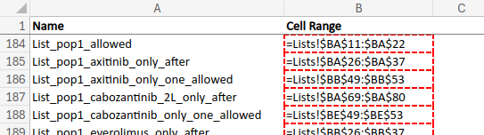

This is a single `.qmd` file that walks through the code in `Model_Structure.R`. It is rendered as a single file, then the output `.md` file is split into seperate `.md` files that can be incorporated into seperate `.qmd` pages.

This is done as running the code within seperate `.qmd` pages requires that the global environment is shared between them, which is difficult to achieve without long run times or very large files containing the environment.

SPLITMD_CODE1_START

This page contains some of the basic set-up steps like **loading the functions** and lots of the **model inputs**, as well as establishing the **possible treatment sequences**.

::: {.callout-warning collapse="true"}

## Adjustments

The adjustments from `Model_Structure.R` on this page are:

* Changed the path to the folders - e.g. "./3_Functions" to "../../../3_Functions".
  * Instead of amending this in each string, I created `path_` variables to store the path to the folder, and then imported individual files using `file.path()` to combine the folder path with the file name.
  * These folder paths are all set-up in a code chunk `paths` after we load the required packages.
* Set `f_excel_extract()` from `verbose = TRUE` to `verbose = FALSE`, as it otherwise repeatedly prints "Extracting named range X from ../../1_Data/ID6184_RCC_model inputs FAD version [UK RWE unredacted, ACIC redacted, cPAS redacted].xlsm" where X is the name of each parameter

:::

## Load required packages


::: {.cell}

```{.r .cell-code}
#### 1. Installation ###########
#### This code has been created using R version 4.3.1
#### All packages used by this model are provided here

#### Comment out the below section which installs the relevant packages after the first run of the model
# install.packages("shiny", quiet = TRUE)   ### the quiet argument is used to avoid warnings appearing in the console (useful for later conversion to web app)
# install.packages("gtools", quiet = TRUE)
# install.packages("openxlsx", quiet = TRUE)
# install.packages("flexsurv", quiet = TRUE)
# install.packages("tidyverse", quiet = TRUE)
# install.packages("data.table", quiet = TRUE)
# install.packages("heemod", quiet = TRUE)
# install.packages("logOfGamma", quiet = TRUE)
# install.packages("ggplot2", quiet = TRUE)
# install.packages("survminer", quiet = TRUE)
# install.packages("officer", quiet = TRUE)
# install.packages("officedown", quiet = TRUE)
# install.packages("magrittr", quiet = TRUE)
# install.packages("Hmisc", quiet = TRUE)
# install.packages("future.apply", quiet = TRUE)
# install.packages("crosstable", quiet = TRUE)
# install.packages("flextable", quiet = TRUE)
# install.packages("stringr", quiet = TRUE)
# install.packages("BCEA", quiet = TRUE)
# install.packages("collapse", quiet = TRUE)
# install.packages("scales", quiet = TRUE)
# install.packages("Matrix", quiet = TRUE)
# install.packages("dplyr", quiet = TRUE)
# install.packages("progressr", quiet = TRUE)
# install.packages("microbenchmark", quiet = TRUE)

### Loading libraries 

#### This section needs to be run every time and calls each package from the library 
library(shiny, quiet = TRUE)   
library(gtools, quiet = TRUE)
library(openxlsx, quiet = TRUE)
library(flexsurv, quiet = TRUE)
library(tidyverse, quiet = TRUE)
library(data.table, quiet = TRUE)
library(heemod, quiet = TRUE)
library(logOfGamma, quiet = TRUE)
library(ggplot2, quiet = TRUE)
library(survminer, quiet = TRUE)
library(officer, quiet = TRUE)
library(officedown, quiet = TRUE)
library(magrittr, quiet = TRUE)
library(Hmisc, quiet = TRUE)
library(future.apply, quiet = TRUE)
library(crosstable, quiet = TRUE)
library(flextable, quiet = TRUE)
library(stringr, quiet = TRUE)
library(BCEA, quiet = TRUE)
library(collapse, quiet = TRUE)
library(scales, quiet = TRUE)
library(Matrix, quiet = TRUE)
library(dplyr, quiet = TRUE)
library(progressr, quiet = TRUE)
library(microbenchmark, quiet = TRUE)
```
:::


## Set file paths


::: {.cell}

```{.r .cell-code}
# Set path to folders
d_path = "../../../1_Data"
f_path = "../../../3_Functions"
o_path = "../../../4_Output"
```
:::


## Define some of the model settings

The majority of this code block is dedicated to setting the model to **run sequentially or in parallel**. If running the base case using `Model_Structure.R` as provided (e.g. with pre-run survival analysis), you may find that the quickest option is to run the model sequentially. This is already set up by default, with `keep_free_cores <- NA`. For reference, the run time for this on an Intel Core i7-12700H with 32GB RAM running Ubuntu 22.04.4 Linux was 40 minutes.


::: {.cell}

```{.r .cell-code}
# Multi-core processing:
# 
# Instructions.
# 
# This model is highly RAM intensive. You need a lot of RAM on your computer
# to run this model due to the large amount of very large matrix multiplications
# (up to approximately 15,000 discrete health states in the model). Therefore,
# in order to efficiently run the model, it is a balancing act between RAM
# usage and CPU usage. 
# 
# Some rough guidance is:
# 
# - If you have 8GB of RAM on your computer, you can run this model with 2 cores only
#   but it may even be faster to run in series if you have other things open on your
#   computer at the same time. Therefore, please set keep_free_cores to NA and run
#   the model in series. This is because when the RAM on your computer runs out
#   your computer will use the hard-disk instead which is extremely slow.
# - If you have 16GB of RAM on your computer, parallel should be a lot faster.
#   On my laptop (I7 8th gen, 16GB RAM, running Linux for low RAM usage) I can
#   run with 5 cores whilst using about 12GB of RAM running this model. 
# - if you have 24GB or 32GB of RAM, you should be able to run the model with 8
#   and up to around 14 cores before running out of RAM whilst running the model.
# - if you are using a HPC, you should be able to run this model with many cores
#   due to the typically large amount of RAM available per core in a HPC
# 
# 
# IF YOU DO NOT WANT MULTICORE SET keep_free_cores TO NA
# 
# 
keep_free_cores <- NA
if (any(is.na(keep_free_cores), keep_free_cores<0)) {
  plan(sequential)
} else {
  plan(multisession(workers = max(availableCores()-keep_free_cores,1)))
}
```
:::


The three settings in this code block:

* `progressr::handlers("progress")` - one of the settings for how progress is reported whilst code is running
* `crosstable::options(crosstable_units="cm")` - the `crosstable` package generates descriptive statistics with function `crosstable()`, and this sets the unit for it, although it should be noted that this appears to be legacy code as it doesn't appear that `crosstable()` is used anywhere in the repository
* `qc_mode` - the input for `verbose` in `f_NMA_AddAssumptionsToNetwork()` which, if true, will mean that extra outputs are printed to the console


::: {.cell}

```{.r .cell-code}
# Other generic settings for the progress bar and units for table widths
handlers("progress")
options(crosstable_units="cm")

#### 2. Loading functions ###########


# This variable is used throughout the model to define whether to provide additional outputs useful for QC or not
# The model will take longer to run when this is set to TRUE
qc_mode <- FALSE
```
:::


## Import model functions

The functions for the analysis in `Model_Structure.R` are stored in the `3_Functions/` folder. Here, they are imported into our environment.


::: {.cell}

```{.r .cell-code}
# 2.1. Excel data extraction functions -----------------------------------------

#### These functions are used to extract parameters from the Excel input workbook for use in R
#### During Phase 2 a Shiny front-end will be added to the model which will allow an alternative mechanism to upload these types of inputs

source(file.path(f_path, "excel/extract.R"))

# 2.2. Treatment sequencing functions ----------------------------------------

#### Function: filter to active treatments and lines
##### Takes as an input the defined sequences, evaluation type and line to start the evaluation from 
##### Other input is % receiving each subs therapy at each line dependent on previous treatments received 
##### Reweights so that the % receiving each treatment sums to 100% within each arm / line being studied
##### Outputs a matrix that has the % receiving each possible combination

source(file.path(f_path, "sequencing/sequences.R"))

# 2.3. Survival analysis functions ---------------------------------------------

# Function: conduct survival analysis
##### by treatment, line, population and outcome fitted survival curves using Flexsurvreg (exp, Weibull, lognormal, loglog, Gompertz, gen gamma)
##### calculation of and adjustment for general population
##### adjustment for treatment effect waning

source(file.path(f_path, "survival/Survival_functions.R"))
source(file.path(f_path, "survival/other_cause_mortality.R"))
source(file.path(f_path, "survival/treatment_effect_waning.R"))

# 2.4 Misc functions ----------------------------------------------------------

### these functions enable smoother data cleaning and manipulation

source(file.path(f_path, "misc/other.R"))
source(file.path(f_path, "misc/shift_and_pad.R"))
source(file.path(f_path, "misc/cleaning.R"))

# 2.4.1 Functions imposing list structures -----------------------------------

source(file.path(f_path, "misc/nesting.R"))
source(file.path(f_path, "misc/discounting.R"))
source(file.path(f_path, "misc/qdirichlet.R"))
source(file.path(f_path, "misc/plotting.R"))
source(file.path(f_path, "misc/structure.R"))

# 2.4.2 Functions calculating HRs from FPNMA coefficients and other FPNMA manipulation ------

source(file.path(f_path, "misc/fpnma_fns.R"))


# 2.5 Utility functions -------------------------------------------------------

source(file.path(f_path, "utility/age_related.R"))
source(file.path(f_path, "costs_and_QALYs/utility_processing.R"))

# 2.6 AE functions --------------------------------------------------------

source(file.path(f_path, "adverse_events/AE_steps.R"))

# 2.7 Cost calculation functions --------------------------------------------

source(file.path(f_path, "costs_and_QALYs/cost_processing.R"))


# 2.8 State transition modelling functions --------------------------------

source(file.path(f_path, "markov/markov.R"))

# 2.9 Patient flow functions ----------------------------------------------

source(file.path(f_path, "patient_flow/overarching.R"))
source(file.path(f_path, "patient_flow/partitioned_survival.R"))
source(file.path(f_path, "patient_flow/markov.R"))
source(file.path(f_path, "patient_flow/drug_costs.R"))
source(file.path(f_path, "patient_flow/hcru_costs.R"))
source(file.path(f_path, "patient_flow/qalys.R"))
source(file.path(f_path, "patient_flow/ae.R"))


# 2.10 Results processing functions ---------------------------------------

source(file.path(f_path, "results/incremental_analysis.R"))
source(file.path(f_path, "results/model_averaging.R"))
source(file.path(f_path, "results/partitioned_survival.R"))
source(file.path(f_path, "misc/severity_modifier.R"))
source(file.path(f_path, "results/results_tables.R"))
source(file.path(f_path, "psa/psa functions.R"))


# 2.11 Office software outputs --------------------------------------------

source(file.path(f_path, "reporting/word_document_output.R"))
```
:::


## Get some of the model inputs

### Introductory comments

This section of the code is mostly comments that describe:

* The structure of `i` which contains model inputs
* That survival analysis will be conducted using state transition (markov) models and partitioned survival analysis (partSA)
* The five input files, which are detailed within the documentation on the page [Input data](../input_data.qmd)

There is a line of code to define `User_types`, but this appears to be legacy as it is not used anywhere.


::: {.cell}

```{.r .cell-code}
# 3. Model inputs structure --------------------------------------------------

# Model inputs should be in a list called i. This list then contains all of the
# inputs for the model, NOT the parameters used to calculate the model. In effect,
# this is a place to store all model information BEFORE it gets boiled down to
# what's needed to run 1 model.
# 
# using i allows subsetting by categorisation, which makes things a lot easier
# to find and avoids all long variable names
# 
# the structure of i should be by category. There are the following 
# categories:
# 
# dd - dropdown inputs taken from Excel
# i - parameter inputs taken from Excel
# r_ tables taken from Excel
# List, id and lookup - lists defined and used within the code
# basic - basic inputs (time horizon, cycle length, discount rates, so on so forth)
# surv  - survival analysis inputs including raw data
# sequences and seq - inputs and outputs related to the possible sequences of treatments
# cost  - drug and hcru costs. All costs are here to keep things together (dosing is not cost)
# util and QALYs  - utility and QALY inputs
# misc  - misc inputs e.g. graph labelling
# 

#### 3.1 Loading input parameters ###########

# This model allows two possible structures to be analysed: state transition with a user definable number of lines
# with health states based on time to discontinuation (drug costs) and progression status (quality of life and movement 
# between lines) and PartSA with 3 health states (pre-progression, post-progression and death)

# During Phase 1 of this pilot we use the model to evaluate the decision problem for a single therapy 
# (cabo+nivo, defined as molecule 1) starting at 1st line
# During Phase 2 we will adapt this code to evaluate the cost-effectiveness of sequences starting at a user-defined line

# Inputs to this model need to be downloaded from NICEdocs 

User_types <- c("Submitting company", "NICE", "EAG", "Committee", "NHSE", "Clinical expert", "Patient expert", "Non-intervention stakeholder", "Public")

# The submitting company are able to see their own CIC and AIC data (marked up blue / yellow in reporting but not anything else: green marking
# green marked data has been either be replaced with 0 [PAS discounts, RWE IPD] or dummy data)
# NICE users will be able to see everything
# Other users will not be able to see any marked data, this is replaced with dummy data

# The way raw data is fed into the model currently works as follows
# Define the path to where the data file lives using the select file functionality

# The model then processes the file the user selected

# There are a number of files which contain raw or intermediate inputs:
# 1. The Excel user interface - this contains information from company data and the UK RWE
# 2. The proportional hazards NMA CODA RDS file - this contains information from company data
# 3. The fractional polynomials NMA RDS file - this contains information from company data 
# 4. Either the raw data file containing the pseudo-IPD for all trials for survival analysis (RWE and company data included); or
# 5. The RDS output from the survival analysis using both RWE and company data

# You will need to manually select the inputs file relevant to your user type, this is not stored on Github as access to CIC information differs by user type
```
:::


### Get inputs from excel workbook and save as list `i`

Import the file at `excel_path` using `f_excel_extract()`, and then tidy `i$R_table_param` using `f_excel_cleanParams()`.

If the file doesn't exist, assuming the user is in RStudio, a dialog box will appear with the system files, and the user should then select a file from their directory. The dialog will open in `1_Data/`, show only `.xlsm` files, and the accept/ok button has the text `ID6184_RCC_model inputs....xlsm`.


::: {.cell}

```{.r .cell-code}
# The first part of this code pulls all of the named ranges from the excel workbook, expand the parameters table

#Option to define Excel path on local machine - comment in this and comment out the code below to select file
excel_path <- file.path(d_path, "ID6184_RCC_model inputs FAD version [UK RWE unredacted, ACIC redacted, cPAS redacted].xlsm")
#i <- f_excel_extract(excel_path, verbose = TRUE)

if (file.exists(excel_path)) {
  i <- f_excel_extract(excel_path, verbose = FALSE)
} else {
  i <- f_excel_extract(rstudioapi::selectFile(
    caption = "Select the Excel inputs file (ID6184_RCC_model inputs....xlsm)",
    label = "ID6184_RCC_model inputs....xlsm",
    path = "./1_Data/",
    filter = "Excel Files (*.xlsm)",
    existing = TRUE
  ), verbose = FALSE)
}

i <- c(i,f_excel_cleanParams(i$R_table_param))
```
:::


::: {.callout-note collapse="true"}

## What does `f_excel_extract()` do?

This function uses `openxlsx::getNamedRegions()` to find named regions in the workbook. These are all stored in a sheet called `named ranges`. As illustrated in [Input data](../input_data.qmd), these consist of two columns:

* A name for the region (e.g. `List_pop1_allowed`)
* The region, which consists of the: sheet, column/s and row/s (e.g. `=Lists!$BA$11:$BA$22`)



The function `f_excel_extract()` extracts each of these, saving them into a nested list called `i`. Each element in the list is a row from the `named ranges` sheet - for example:


::: {.cell}

```{.r .cell-code}
i$List_pop1_allowed
```

::: {.cell-output .cell-output-stdout}

```
 [1] "avelumab_plus_axitinib"      "axitinib"                   
 [3] "cabozantinib"                "everolimus"                 
 [5] "lenvatinib_plus_everolimus"  "cabozantinib_plus_nivolumab"
 [7] "nivolumab_monotherapy"       "pazopanib"                  
 [9] "sunitinib"                   "tivozanib"                  
```


:::
:::


The exception is the first element which is a copy of the named ranges sheet:


::: {.cell}

```{.r .cell-code}
head(i[[1]])
```

::: {.cell-output-display}

:::
:::


:::

::: {.callout-note collapse="true"}

## What does `f_excel_cleanParams()` do?

This function is applied to `i$R_table_param` which is the full table from the sheet `All parameters`.


::: {.cell}

```{.r .cell-code}
head(i$R_table_param)
```

::: {.cell-output-display}

:::
:::


The function `f_excel_cleanParams()`:

* Converts each row of the table into a list, with value from `Parameter.name` used as the list name
* Adds `Mean` which is simply `Mean.current.value` converted to numeric

These lists were then concatenated with `i`, so we can access them from `i` as follows:


::: {.cell}

```{.r .cell-code}
i$cabo_nivo_include
```

::: {.cell-output .cell-output-stdout}

```
$Parameter.description
[1] "Include cabo nivo? (1=yes, 0=no)"

$Parameter.name
[1] "cabo_nivo_include"

$Mean.current.value
[1] "1"

$Mean
[1] 1
```


:::
:::


:::

### Manually add some extra inputs to `i`


::: {.cell}

```{.r .cell-code}
# Set which decision problem to look at, initially functionality has been geared towards the decision problem for cabozantinib plus nivolumab
i$decision_problem <- "cabo+nivo"

# We then create a place for identifiers. Adding in an object to i full of lookup tables makes automated translation
# possible even when one doesn't know the number of items ex ante, or how they combine.
# 
# If the lookup table is correct one can translate id numbers to text strings which are
# consistent throughout the entire model. This is extremely useful as the model can
# be expanded to any number of treatments and potentially even any number of lines 
# (up to a reasonable maximum)

i$id     <- list(ipd = list())
i$lookup <- list(ipd = list())

# Add distribution names to i
# This model only includes standard parametric distributions as more complex distributions were not deemed to be required for the included treatments

i$distnames <- 
  c(
    gengamma      = "gengamma",
    exp           = "exp",
    weibull       = "weibull",
    lnorm         = "lnorm",
    gamma         = "gamma",
    gompertz      = "gompertz",
    llogis        = "llogis"
  )
```
:::


### Use `i` to make another list `p`


::: {.cell}

```{.r .cell-code}
# The next step is to then "tidy up" i into another object, p. p doesn't necessarily
# have to house everything, only things that will change in PSA

p <- f_misc_param_generate_p(i)

# Set seed for PSA - note this is done in the script to run the PSA, not here!
# set.seed(1475)

# Max lines within the R model
p$basic$R_maxlines <- 4

# Pass this into p so that p can be used to exclusively compute the model:
p$basic$decision_problem <- i$decision_problem
```
:::


## Treatment sequences


::: {.cell}

```{.r .cell-code}
#### 3.2 Define sequences  ###########

#### This code produces a list of possible sequences per population based upon the rules defined for RCC
#### and the user input number of lines


# Add drug names to comparators vector extracted from inputs list.

i$sequences <- f_generate_sequences(
  comparators = i$List_comparators, 
  maxlines    = p$basic$R_maxlines
)

# restrict the pathways to those that are possible and permitted.
i$sequences <- as.data.frame(i$sequences)

populations <- i$i_nr_populations

seqs <- NULL
for (population in 1:populations) {
  cat("Applying sequence restrictions to population", population,"\n")
  
  s <- f_path_tx_restrict(
    sequences                = i$sequences,
    allowed                  = f_get_allowed_lists(i, population), #overall list of allowed drugs in this popn
    L1                       = f_get_L1_lists(i, population), # 1L drugs allowed in this popn
    L2                       = f_get_L2_lists(i, population), # 2L drugs allowed in this popn
    L3                       = f_get_L3_lists(i, population), # 3L drugs allowed in this popn
    L4                       = f_get_L4_lists(i, population), # 4L drugs allowed in this popn
    only_after               = f_get_only_after_lists(i, population), #list of restrictions where tx can be only after the listed txs
    not_immediate_after      = f_get_not_immediate_after_lists(i, population), #list of restrictions where tx can be only immediately before the listed txs
    one_in_list              = f_get_one_in_list_lists(i, population), #list of restrictions where only one of the tx in each list is allowed 
    only_after_one           = f_get_only_after_one_lists(i, population), #list of restrictions where only one of the listed treatments is allowed prior to current therapy 
    L2_only_after            = f_get_2L_only_after_lists(i, population), #list of 2L+ restrictions: if drug is used 2L, 3L or 4L, can only be after drug x
    L2_only_immediate_after  = f_get_2L_only_immediate_after_lists(i, population), #list of 2L+ restrictions: if drug is used 2L, 3L or 4L, can only be immediately after drug x
    L2_only_one              = f_get_2L_only_one_lists(i, population) #list of 2L+ drugs where only one of them allowed in a given sequence
  )
  s <- cbind(rep(paste0("pop", population),nrow(s)), s)
  colnames(s) <- paste0('V', seq_len(ncol(s))) # rbind no longer likes un-named columns so added this
  seqs <- rbind(seqs, s)
}
```

::: {.cell-output .cell-output-stdout}

```
Applying sequence restrictions to population 1 
Dropping drugs not allowed for this population.
applying rule: avelumab_plus_axitinib axitinib cabozantinib everolimus lenvatinib_plus_everolimus cabozantinib_plus_nivolumab nivolumab_monotherapy pazopanib sunitinib tivozanib are only allowed treatments.
Permutations before applying rule: 26404 
Permutations after applying rule : 5860 
applying rule: drug line restrictions.
Permutations before applying rule: 5860 
Permutations after applying rule : 628 
[1] "axitinib"
applying rule. axitinib is only allowed after avelumab_plus_axitinib cabozantinib lenvatinib_plus_everolimus cabozantinib_plus_nivolumab pazopanib lenvatinib_plus_pembrolizumab sunitinib tivozanib 
Permutations before applying rule: 628 
Permutations after applying rule : 628 
[1] "everolimus"
applying rule. everolimus is only allowed after avelumab_plus_axitinib axitinib cabozantinib lenvatinib_plus_everolimus cabozantinib_plus_nivolumab pazopanib lenvatinib_plus_pembrolizumab sunitinib tivozanib 
Permutations before applying rule: 628 
Permutations after applying rule : 628 
[1] "lenvatinib_plus_everolimus"
applying rule. lenvatinib_plus_everolimus is not allowed immediately after nivolumab_plus_ipilimumab 
Permutations before applying rule: 628 
Permutations after applying rule : 628 
[1] "axitinib"
applying rule axitinib : avelumab_plus_axitinib axitinib cannot be in one permutation
Permutations before applying rule: 628 
Permutations after applying rule : 559 
[1] "cabozantinib"
applying rule cabozantinib : cabozantinib cabozantinib_plus_nivolumab cannot be in one permutation
Permutations before applying rule: 559 
Permutations after applying rule : 520 
[1] "everolimus"
applying rule everolimus : lenvatinib_plus_everolimus everolimus cannot be in one permutation
Permutations before applying rule: 520 
Permutations after applying rule : 452 
[1] "io"
applying rule io : avelumab_plus_axitinib nivolumab_plus_ipilimumab cabozantinib_plus_nivolumab nivolumab_monotherapy lenvatinib_plus_pembrolizumab cannot be in one permutation
Permutations before applying rule: 452 
Permutations after applying rule : 400 
[1] "nivolumab"
applying rule nivolumab : nivolumab_plus_ipilimumab cabozantinib_plus_nivolumab nivolumab_monotherapy cannot be in one permutation
Permutations before applying rule: 400 
Permutations after applying rule : 400 
[1] "TKIs"
applying rule TKIs : sunitinib pazopanib tivozanib cannot be in one permutation
Permutations before applying rule: 400 
Permutations after applying rule : 202 
[1] "lenvatinib_plus_everolimus"
applying rule: lenvatinib_plus_everolimus can only be after ONE of avelumab_plus_axitinib axitinib cabozantinib cabozantinib_plus_nivolumab pazopanib lenvatinib_plus_pembrolizumab sunitinib tivozanib 
Permutations before applying rule: 202 
Permutations after applying rule : 182 
[1] "cabozantinib"
applying rule: cabozantinib as 2L+ only allowed after avelumab_plus_axitinib axitinib lenvatinib_plus_everolimus cabozantinib_plus_nivolumab pazopanib lenvatinib_plus_pembrolizumab sunitinib tivozanib 
Permutations before applying rule: 182 
Permutations after applying rule : 182 
[1] "pazopanib"
applying rule: pazopanib as 2L+ only allowed immediately after avelumab_plus_axitinib lenvatinib_plus_pembrolizumab cabozantinib_plus_nivolumab nivolumab_plus_ipilimumab 
Permutations before applying rule: 182 
Permutations after applying rule : 172 
[1] "sunitinib"
applying rule: sunitinib as 2L+ only allowed immediately after avelumab_plus_axitinib lenvatinib_plus_pembrolizumab cabozantinib_plus_nivolumab nivolumab_plus_ipilimumab 
Permutations before applying rule: 172 
Permutations after applying rule : 162 
[1] "tivozanib"
applying rule: tivozanib as 2L+ only allowed immediately after avelumab_plus_axitinib lenvatinib_plus_pembrolizumab cabozantinib_plus_nivolumab nivolumab_plus_ipilimumab 
Permutations before applying rule: 162 
Permutations after applying rule : 152 
Applying sequence restrictions to population 2 
Dropping drugs not allowed for this population.
applying rule: avelumab_plus_axitinib axitinib cabozantinib everolimus nivolumab_plus_ipilimumab lenvatinib_plus_everolimus cabozantinib_plus_nivolumab nivolumab_monotherapy pazopanib lenvatinib_plus_pembrolizumab sunitinib tivozanib are only allowed treatments.
Permutations before applying rule: 26404 
Permutations after applying rule : 13344 
applying rule: drug line restrictions.
Permutations before applying rule: 13344 
Permutations after applying rule : 1036 
[1] "axitinib"
applying rule. axitinib is only allowed after avelumab_plus_axitinib cabozantinib lenvatinib_plus_everolimus cabozantinib_plus_nivolumab pazopanib lenvatinib_plus_pembrolizumab sunitinib tivozanib 
Permutations before applying rule: 1036 
Permutations after applying rule : 1017 
[1] "everolimus"
applying rule. everolimus is only allowed after avelumab_plus_axitinib axitinib cabozantinib lenvatinib_plus_everolimus cabozantinib_plus_nivolumab pazopanib lenvatinib_plus_pembrolizumab sunitinib tivozanib 
Permutations before applying rule: 1017 
Permutations after applying rule : 1004 
[1] "lenvatinib_plus_everolimus"
applying rule. lenvatinib_plus_everolimus is not allowed immediately after nivolumab_plus_ipilimumab 
Permutations before applying rule: 1004 
Permutations after applying rule : 984 
[1] "axitinib"
applying rule axitinib : avelumab_plus_axitinib axitinib cannot be in one permutation
Permutations before applying rule: 984 
Permutations after applying rule : 915 
[1] "cabozantinib"
applying rule cabozantinib : cabozantinib cabozantinib_plus_nivolumab cannot be in one permutation
Permutations before applying rule: 915 
Permutations after applying rule : 876 
[1] "everolimus"
applying rule everolimus : lenvatinib_plus_everolimus everolimus cannot be in one permutation
Permutations before applying rule: 876 
Permutations after applying rule : 773 
[1] "io"
applying rule io : avelumab_plus_axitinib nivolumab_plus_ipilimumab cabozantinib_plus_nivolumab nivolumab_monotherapy lenvatinib_plus_pembrolizumab cannot be in one permutation
Permutations before applying rule: 773 
Permutations after applying rule : 657 
[1] "lenvatinib_plus_everolimus"
applying rule lenvatinib_plus_everolimus : lenvatinib_plus_everolimus lenvatinib_plus_pembrolizumab cannot be in one permutation
Permutations before applying rule: 657 
Permutations after applying rule : 638 
[1] "nivolumab"
applying rule nivolumab : nivolumab_plus_ipilimumab cabozantinib_plus_nivolumab nivolumab_monotherapy cannot be in one permutation
Permutations before applying rule: 638 
Permutations after applying rule : 638 
[1] "TKIs"
applying rule TKIs : sunitinib pazopanib tivozanib cannot be in one permutation
Permutations before applying rule: 638 
Permutations after applying rule : 386 
[1] "lenvatinib_plus_everolimus"
applying rule: lenvatinib_plus_everolimus can only be after ONE of avelumab_plus_axitinib axitinib cabozantinib cabozantinib_plus_nivolumab pazopanib lenvatinib_plus_pembrolizumab sunitinib tivozanib 
Permutations before applying rule: 386 
Permutations after applying rule : 359 
[1] "cabozantinib"
applying rule: cabozantinib as 2L+ only allowed after avelumab_plus_axitinib axitinib nivolumab_plus_ipilimumab lenvatinib_plus_everolimus cabozantinib_plus_nivolumab pazopanib lenvatinib_plus_pembrolizumab sunitinib tivozanib 
Permutations before applying rule: 359 
Permutations after applying rule : 359 
[1] "pazopanib"
applying rule: pazopanib as 2L+ only allowed immediately after avelumab_plus_axitinib lenvatinib_plus_pembrolizumab cabozantinib_plus_nivolumab nivolumab_plus_ipilimumab 
Permutations before applying rule: 359 
Permutations after applying rule : 339 
[1] "sunitinib"
applying rule: sunitinib as 2L+ only allowed immediately after avelumab_plus_axitinib lenvatinib_plus_pembrolizumab cabozantinib_plus_nivolumab nivolumab_plus_ipilimumab 
Permutations before applying rule: 339 
Permutations after applying rule : 319 
[1] "tivozanib"
applying rule: tivozanib as 2L+ only allowed immediately after avelumab_plus_axitinib lenvatinib_plus_pembrolizumab cabozantinib_plus_nivolumab nivolumab_plus_ipilimumab 
Permutations before applying rule: 319 
Permutations after applying rule : 299 
Applying sequence restrictions to population 3 
Dropping drugs not allowed for this population.
applying rule: axitinib cabozantinib everolimus lenvatinib_plus_everolimus nivolumab_monotherapy pazopanib sunitinib tivozanib are only allowed treatments.
Permutations before applying rule: 26404 
Permutations after applying rule : 2080 
applying rule: drug line restrictions.
Permutations before applying rule: 2080 
Permutations after applying rule : 330 
[1] "axitinib"
applying rule. axitinib is only allowed after avelumab_plus_axitinib cabozantinib lenvatinib_plus_everolimus cabozantinib_plus_nivolumab pazopanib lenvatinib_plus_pembrolizumab sunitinib tivozanib 
Permutations before applying rule: 330 
Permutations after applying rule : 330 
[1] "everolimus"
applying rule. everolimus is only allowed after avelumab_plus_axitinib axitinib cabozantinib lenvatinib_plus_everolimus cabozantinib_plus_nivolumab pazopanib lenvatinib_plus_pembrolizumab sunitinib tivozanib 
Permutations before applying rule: 330 
Permutations after applying rule : 330 
[1] "lenvatinib_plus_everolimus"
applying rule. lenvatinib_plus_everolimus is not allowed immediately after nivolumab_plus_ipilimumab 
Permutations before applying rule: 330 
Permutations after applying rule : 330 
[1] "axitinib"
applying rule axitinib : avelumab_plus_axitinib axitinib cannot be in one permutation
Permutations before applying rule: 330 
Permutations after applying rule : 330 
[1] "everolimus"
applying rule everolimus : lenvatinib_plus_everolimus everolimus cannot be in one permutation
Permutations before applying rule: 330 
Permutations after applying rule : 288 
[1] "lenvatinib_plus_everolimus"
applying rule lenvatinib_plus_everolimus : lenvatinib_plus_everolimus lenvatinib_plus_pembrolizumab cannot be in one permutation
Permutations before applying rule: 288 
Permutations after applying rule : 288 
[1] "TKIs"
applying rule TKIs : sunitinib pazopanib tivozanib cannot be in one permutation
Permutations before applying rule: 288 
Permutations after applying rule : 120 
[1] "lenvatinib_plus_everolimus"
applying rule: lenvatinib_plus_everolimus can only be after ONE of axitinib cabozantinib pazopanib lenvatinib_plus_pembrolizumab sunitinib tivozanib 
Permutations before applying rule: 120 
Permutations after applying rule : 111 
[1] "cabozantinib"
applying rule: cabozantinib as 2L+ only allowed after avelumab_plus_axitinib axitinib lenvatinib_plus_everolimus cabozantinib_plus_nivolumab pazopanib lenvatinib_plus_pembrolizumab sunitinib tivozanib 
Permutations before applying rule: 111 
Permutations after applying rule : 111 
[1] "pazopanib"
applying rule: pazopanib as 2L+ only allowed immediately after avelumab_plus_axitinib lenvatinib_plus_pembrolizumab cabozantinib_plus_nivolumab nivolumab_plus_ipilimumab 
Permutations before applying rule: 111 
Permutations after applying rule : 111 
[1] "sunitinib"
applying rule: sunitinib as 2L+ only allowed immediately after avelumab_plus_axitinib lenvatinib_plus_pembrolizumab cabozantinib_plus_nivolumab nivolumab_plus_ipilimumab 
Permutations before applying rule: 111 
Permutations after applying rule : 111 
[1] "tivozanib"
applying rule: tivozanib as 2L+ only allowed immediately after avelumab_plus_axitinib lenvatinib_plus_pembrolizumab cabozantinib_plus_nivolumab nivolumab_plus_ipilimumab 
Permutations before applying rule: 111 
Permutations after applying rule : 111 
Applying sequence restrictions to population 4 
Dropping drugs not allowed for this population.
applying rule: axitinib cabozantinib everolimus lenvatinib_plus_everolimus nivolumab_monotherapy pazopanib sunitinib tivozanib are only allowed treatments.
Permutations before applying rule: 26404 
Permutations after applying rule : 2080 
applying rule: drug line restrictions.
Permutations before applying rule: 2080 
Permutations after applying rule : 440 
[1] "axitinib"
applying rule. axitinib is only allowed after avelumab_plus_axitinib cabozantinib lenvatinib_plus_everolimus cabozantinib_plus_nivolumab pazopanib lenvatinib_plus_pembrolizumab sunitinib tivozanib 
Permutations before applying rule: 440 
Permutations after applying rule : 440 
[1] "everolimus"
applying rule. everolimus is only allowed after avelumab_plus_axitinib axitinib cabozantinib lenvatinib_plus_everolimus cabozantinib_plus_nivolumab pazopanib lenvatinib_plus_pembrolizumab sunitinib tivozanib 
Permutations before applying rule: 440 
Permutations after applying rule : 440 
[1] "lenvatinib_plus_everolimus"
applying rule. lenvatinib_plus_everolimus is not allowed immediately after nivolumab_plus_ipilimumab 
Permutations before applying rule: 440 
Permutations after applying rule : 440 
[1] "axitinib"
applying rule axitinib : avelumab_plus_axitinib axitinib cannot be in one permutation
Permutations before applying rule: 440 
Permutations after applying rule : 440 
[1] "everolimus"
applying rule everolimus : lenvatinib_plus_everolimus everolimus cannot be in one permutation
Permutations before applying rule: 440 
Permutations after applying rule : 384 
[1] "lenvatinib_plus_everolimus"
applying rule lenvatinib_plus_everolimus : lenvatinib_plus_everolimus lenvatinib_plus_pembrolizumab cannot be in one permutation
Permutations before applying rule: 384 
Permutations after applying rule : 384 
[1] "TKIs"
applying rule TKIs : sunitinib pazopanib tivozanib cannot be in one permutation
Permutations before applying rule: 384 
Permutations after applying rule : 198 
[1] "lenvatinib_plus_everolimus"
applying rule: lenvatinib_plus_everolimus can only be after ONE of axitinib cabozantinib pazopanib lenvatinib_plus_pembrolizumab sunitinib tivozanib 
Permutations before applying rule: 198 
Permutations after applying rule : 182 
[1] "cabozantinib"
applying rule: cabozantinib as 2L+ only allowed after avelumab_plus_axitinib axitinib lenvatinib_plus_everolimus cabozantinib_plus_nivolumab pazopanib lenvatinib_plus_pembrolizumab sunitinib tivozanib 
Permutations before applying rule: 182 
Permutations after applying rule : 182 
[1] "pazopanib"
applying rule: pazopanib as 2L+ only allowed immediately after avelumab_plus_axitinib lenvatinib_plus_pembrolizumab cabozantinib_plus_nivolumab nivolumab_plus_ipilimumab 
Permutations before applying rule: 182 
Permutations after applying rule : 182 
[1] "sunitinib"
applying rule: sunitinib as 2L+ only allowed immediately after avelumab_plus_axitinib lenvatinib_plus_pembrolizumab cabozantinib_plus_nivolumab nivolumab_plus_ipilimumab 
Permutations before applying rule: 182 
Permutations after applying rule : 182 
[1] "tivozanib"
applying rule: tivozanib as 2L+ only allowed immediately after avelumab_plus_axitinib lenvatinib_plus_pembrolizumab cabozantinib_plus_nivolumab nivolumab_plus_ipilimumab 
Permutations before applying rule: 182 
Permutations after applying rule : 182 
```


:::

```{.r .cell-code}
rownames(seqs) <- NULL

i$sequences <- seqs

#### Uncomment this code to view the sequences and write the sequences defined to csv

# i$sequences
# write.csv(seqs, "4_Output/sequences.csv", row.names = F)
rm(s, seqs, populations)

# define number of cycles and a vector of the cycles 
```
:::


SPLITMD_CODE1_END

SPLITMD_CODE2_START

::: {.callout-warning collapse="true"}

## Adjustments

Changes from `Model_Structure.R`:

* Amend path to `.xlsx` file using d_path

:::


::: {.cell}

```{.r .cell-code}
i$apply_waning_to
```

::: {.cell-output .cell-output-stdout}

```
[1] "ref trt hazard"   "ref trt abs surv"
```


:::
:::


SPLITMD_CODE2_END