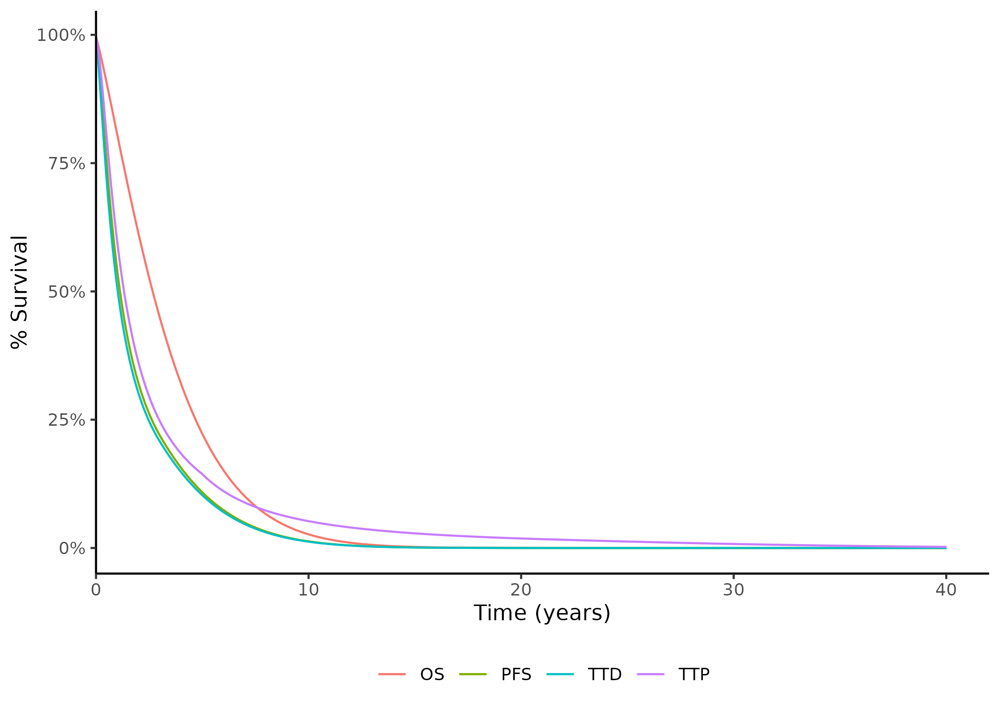
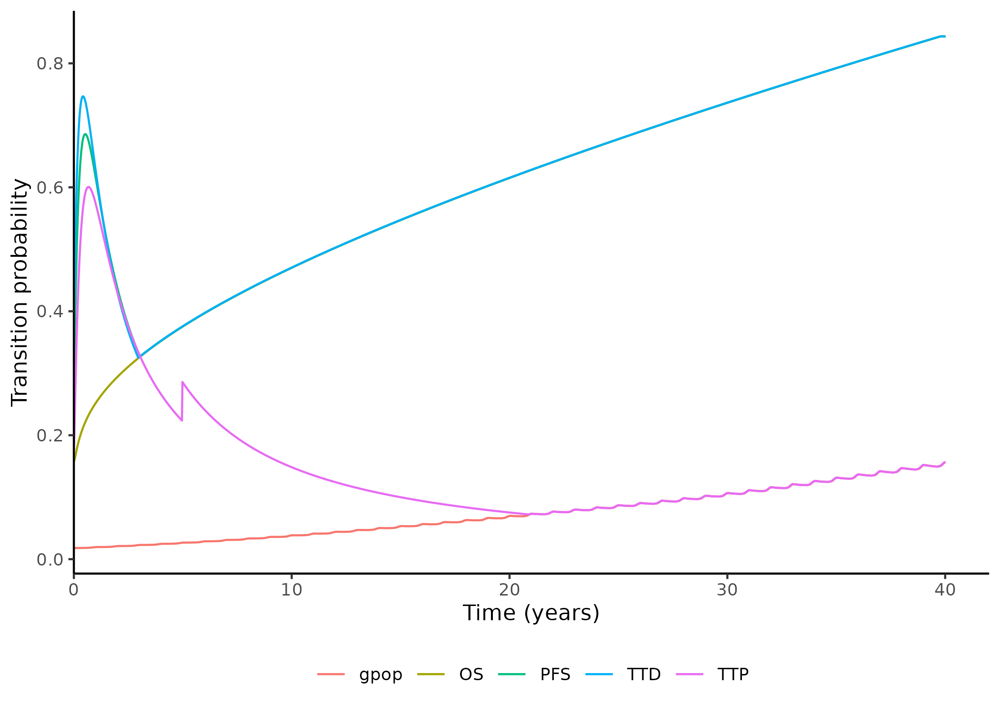

On this page, the hazard ratios (HR) from some pre-run network meta-analyses (NMA) are applied to the extrapolated RWE survival curves generated on the previous page.

## Import and process results of proportional hazards NMA (PH NMA)

### Import results

Import results from the PH NMA, as described in [Input data](../input_data.qmd). The code chunk sets new column names for the result table, and creates a duplicate of the `Endpoint` column called `Reference.endpoint`.


::: {.cell}

```{.r .cell-code}
# 3.3.5 Comparative efficacy propagation (NMA) ---------------------------------------------------------------

# Pull in the data and calculate means by pop line mol endpoint reftrt and reftrial

# First read in RDS file containing the PH NMA coda samples


# 3.3.5.1.1 PH NMA data -----------------------------------------------------

# Option to read in PH NMA CODA from local machine, uncomment this and comment out the line below to use
RDS_path2 <- file.path(d_path, "PH_NMA_CODA.rds")
if (file.exists(RDS_path2)) {
  i$PHNMA <- readRDS(RDS_path2)
} else {
  i$PHNMA <- readRDS(rstudioapi::selectFile(
    caption = "Please select 'PH_NMA_CODA.rds'",
    label = "PH_NMA_CODA.rds",
    path = "./1_Data/",
    filter = "R Files (*.rds)",
    existing = TRUE
  ))
}


colnames(i$PHNMA$data) <- c("Run", "Population", "Line", "Molecule", "Endpoint", "Reference.treatment", "Reference.trial", "HR")
i$PHNMA$data$Reference.endpoint <- i$PHNMA$data$Endpoint
```
:::


::: {.callout-note collapse="true"}

## View `i$PHNMA$data`


::: {.cell}

```{.r .cell-code}
kable(head(i$PHNMA$data))
```

::: {.cell-output-display}


| Run| Population| Line| Molecule| Endpoint| Reference.treatment| Reference.trial|        HR| Reference.endpoint|
|---:|----------:|----:|--------:|--------:|-------------------:|---------------:|---------:|------------------:|
|   1|          0|    1|        4|        0|                   7|               0| 0.8958580|                  0|
|   1|          0|    1|        1|        0|                   7|               0| 0.7821468|                  0|
|   1|          0|    1|        8|        0|                   7|               0| 1.4324613|                  0|
|   1|          0|    1|        2|        0|                   7|               0| 0.7571763|                  0|
|   1|          0|    1|        5|        0|                   7|               0| 0.9492596|                  0|
|   1|          0|    1|        3|        0|                   7|               0| 0.8561836|                  0|


:::
:::


:::

### Set 3L to 2L, and TTD and TTP to PFS

This sections implements some assumptions where we the relative effectiveness of one group/endpoint is assumed to apply to another.

**2L and 3L**: The effectiveness of 3L treatments is assumed to be equal to their effectiveness at 2L, so it simply copies the data the effectiveness data from 2L (`i$PHNMA$data[Line==2,]`) but replaces the `Line` with `3` and appends it to the main data table (`i$PHNMA$data`).

**PFS, TTD and TTP**: The time to treatment discontinuation (TTD) and time to progression (TTP) HRs are assumed to be equal to the HR for progression-free survival (PFS). If we refer to the endpoint look-up table, we can see that PFS is endpoint 1, then TTD is 2 and TTP is 3. Hence, in the code below, the PFS results (`i$PHNMA$data[Endpoint==1,]`) are simply copied, but with the endpoint replaced with 2 or 3, before appending it back to the main data table.

::: {.callout-note collapse="true"}

## View endpoint lookup table


::: {.cell}

```{.r .cell-code}
i$lookup$ipd$endpoint
```

::: {.cell-output-display}

:::
:::


:::


::: {.cell}

```{.r .cell-code}
# IMPORTANT: 3L relative effectiveness is assumed the same as 2L!!!!
# IMPORTANT: 3L relative effectiveness is assumed the same as 2L!!!!
# IMPORTANT: 3L relative effectiveness is assumed the same as 2L!!!!

i$PHNMA$assume3L      <- i$PHNMA$data[Line==2,]
i$PHNMA$assume3L$Line <- 3
i$PHNMA$data         <- rbind(i$PHNMA$data,i$PHNMA$assume3L)

i$PHNMA$assumeTTD <- i$PHNMA$data[Endpoint==1,]
i$PHNMA$assumeTTD$Endpoint <- 2
i$PHNMA$data <- rbind(i$PHNMA$data,i$PHNMA$assumeTTD)

i$PHNMA$assumeTTP <- i$PHNMA$data[Endpoint==1,]
i$PHNMA$assumeTTP$Endpoint <- 3
i$PHNMA$data <- rbind(i$PHNMA$data,i$PHNMA$assumeTTP)

# IMPORTANT: 3L relative effectiveness is assumed the same as 2L!!!!
# IMPORTANT: 3L relative effectiveness is assumed the same as 2L!!!!
# IMPORTANT: 3L relative effectiveness is assumed the same as 2L!!!!
```
:::


::: {.callout-note collapse="true"}

## View `i$PHNMA$data`

To view are implemented assumptions we can, for example, look at the results from 2L and 3L, and see that they are the same:


::: {.cell}

```{.r .cell-code}
kable(head(i$PHNMA$data[i$PHNMA$data$Line==2,]))
```

::: {.cell-output-display}


| Run| Population| Line| Molecule| Endpoint| Reference.treatment| Reference.trial|        HR| Reference.endpoint|
|---:|----------:|----:|--------:|--------:|-------------------:|---------------:|---------:|------------------:|
|   1|          0|    2|       11|        0|                  10|               1| 2.8940210|                  0|
|   1|          0|    2|        8|        0|                  10|               1| 0.6664276|                  0|
|   1|          0|    2|        9|        0|                  10|               1| 0.8515765|                  0|
|   1|          0|    2|        0|        0|                  10|               1| 0.6339945|                  0|
|   1|          0|    2|      999|        0|                  10|               1| 1.4503489|                  0|
|   1|          0|    2|       12|        0|                  10|               1| 2.9477019|                  0|


:::

```{.r .cell-code}
kable(head(i$PHNMA$data[i$PHNMA$data$Line==3,]))
```

::: {.cell-output-display}


| Run| Population| Line| Molecule| Endpoint| Reference.treatment| Reference.trial|        HR| Reference.endpoint|
|---:|----------:|----:|--------:|--------:|-------------------:|---------------:|---------:|------------------:|
|   1|          0|    3|       11|        0|                  10|               1| 2.8940210|                  0|
|   1|          0|    3|        8|        0|                  10|               1| 0.6664276|                  0|
|   1|          0|    3|        9|        0|                  10|               1| 0.8515765|                  0|
|   1|          0|    3|        0|        0|                  10|               1| 0.6339945|                  0|
|   1|          0|    3|      999|        0|                  10|               1| 1.4503489|                  0|
|   1|          0|    3|       12|        0|                  10|               1| 2.9477019|                  0|


:::
:::


:::

### Find mean HRs

The mean HR by population, line, molecule, endpoint, reference treatment and reference trial are calculated.

These are then add to `p`.


::: {.cell}

```{.r .cell-code}
# Calculate the mean from the CODA samples for deterministic analysis

i$PHNMA$means <- i$PHNMA$data[,.(HR = mean(HR)),by=list(Population,Line,Molecule,Endpoint,Reference.treatment,Reference.trial)]


# 3.3.5.1.2 DETERMINISTIC CODA --------------------------------------------

# for the deterministic analysis we use the means. 
p$releff$CODA$PH <- i$PHNMA$means
```
:::


::: {.callout-note collapse="true"}

## View `i$PHNMA$means`


::: {.cell}

```{.r .cell-code}
kable(head(i$PHNMA$means))
```

::: {.cell-output-display}


| Population| Line| Molecule| Endpoint| Reference.treatment| Reference.trial|        HR|
|----------:|----:|--------:|--------:|-------------------:|---------------:|---------:|
|          0|    1|        4|        0|                   7|               0| 0.7935352|
|          0|    1|        1|        0|                   7|               0| 0.7033510|
|          0|    1|        8|        0|                   7|               0| 0.8178626|
|          0|    1|        2|        0|                   7|               0| 0.7226217|
|          0|    1|        5|        0|                   7|               0| 0.9224925|
|          0|    1|        3|        0|                   7|               0| 0.7946571|


:::
:::


:::

## Import and process results of fractional polynomial NMA (FP NMA)

### Import results

Import results from the FP NMA, as described in [Input data](../input_data.qmd). The code chunk sets new column names for the result table, and converts the time from weeks to month (`*52` as 52 weeks per year, then `/12` to get months).


::: {.cell}

```{.r .cell-code}
# 3.3.5.2.1 FP NMA data -----------------------------------------------------

# Load in FP NMA data
i$FPNMA <- list()

#read in means for deterministic and PSA parameters for probabilistic

# option to read in from local machine, uncomment the below and comment out line 949 to use
RDS_path3 <- file.path(d_path, "FPNMA_means.rds")
if (file.exists(RDS_path3)) {
  i$FPNMA$means  <- readRDS(RDS_path3)
} else {
  i$FPNMA$means <- readRDS(rstudioapi::selectFile(
    caption = "Load in FP NMA CODA (FPNMA_means.rds)",
    label = "FPNMA_means.rds",
    path = "./1_Data/",
    filter = "R Files (*.rds)",
    existing = TRUE
  ))
}


#tidy means column names and timing
colnames(i$FPNMA$means)[colnames(i$FPNMA$means) == "intervention_code"] <- "Molecule"
colnames(i$FPNMA$means)[colnames(i$FPNMA$means) == "reference_treatment_code"] <- "Reference.treatment"
colnames(i$FPNMA$means)[colnames(i$FPNMA$means) == "ref_trial_code"] <- "Reference.trial"
colnames(i$FPNMA$means)[colnames(i$FPNMA$means) == "population"] <- "Population"
colnames(i$FPNMA$means)[colnames(i$FPNMA$means) == "line"] <- "Line"
colnames(i$FPNMA$means)[colnames(i$FPNMA$means) == "endpoint"] <- "Endpoint"
colnames(i$FPNMA$means)[colnames(i$FPNMA$means) == "V1"] <- "HR"

i$FPNMA$means$time <- round(i$FPNMA$means$time * 52 / 12)
```
:::


::: {.callout-note collapse="true"}

## View `i$FPNMA$means`


::: {.cell}

```{.r .cell-code}
kable(head(i$FPNMA$means))
```

::: {.cell-output-display}


| time| Molecule| Reference.treatment| Line| Endpoint| Population| Reference.trial|        HR|
|----:|--------:|-------------------:|----:|--------:|----------:|---------------:|---------:|
|    2|        4|                   7|    1|        1|          0|               0| 6.0866273|
|    3|        4|                   7|    1|        1|          0|               0| 0.7948374|
|    4|        4|                   7|    1|        1|          0|               0| 0.6307802|
|    5|        4|                   7|    1|        1|          0|               0| 0.6127038|
|    6|        4|                   7|    1|        1|          0|               0| 0.6141338|
|    7|        4|                   7|    1|        1|          0|               0| 0.6184885|


:::
:::


:::

### Set cabozantinib as reference


::: {.cell}

```{.r .cell-code}
# means

# Rebasing to allow use of cabo as reference treatment in 2nd line
# repeats for means (stored in i which are later transferred to p) 
i$FPNMA$means <- f_rebase_for_cabo_as_ref_in_2L(FPNMAdata = i$FPNMA$means)

# Remove the now redundant objects we made in order to do this
```
:::


### Set 3L to 2L

As implemented for PH NMA, the HRs for 3L are assumed to be the same as at 2L, and this is implemented here using `f_3L_rel_effect_same_as_2L()`.


::: {.cell}

```{.r .cell-code}
# IMPORTANT: 3L relative effectiveness is assumed the same as 2L!!!!
# IMPORTANT: 3L relative effectiveness is assumed the same as 2L!!!!
# IMPORTANT: 3L relative effectiveness is assumed the same as 2L!!!!
i$FPNMA$means <- f_3L_rel_effect_same_as_2L(FPNMAdata = i$FPNMA$means) 

# IMPORTANT: 3L relative effectiveness is assumed the same as 2L!!!!
# IMPORTANT: 3L relative effectiveness is assumed the same as 2L!!!!
# IMPORTANT: 3L relative effectiveness is assumed the same as 2L!!!!
```
:::


### Find unique combinations

`f_gen_destinations()` finds unique combinations of population, line, molecule, endpoint, reference treatment and reference trial. A duplicate version of these results is made where the referebce.trial is set to 2 (real-world evidence (RWE)). These are combined and saved as `i$FPNMA$destinations`.


::: {.cell}

```{.r .cell-code}
# Create 1 row for each destination PLMTE, so that we know where to put the
# fp data without having to iterate much
i$FPNMA$destinations <- f_gen_destinations(fp_data = i$FPNMA$means)
```
:::


::: {.callout-note collapse="true"}

## View `i$FPNMA$destinations`


::: {.cell}

```{.r .cell-code}
kable(head(i$FPNMA$destinations))
```

::: {.cell-output-display}


| Population| Line| Molecule| Endpoint| Reference.treatment| Reference.trial|
|----------:|----:|--------:|--------:|-------------------:|---------------:|
|          0|    1|        4|        1|                   7|               0|
|          0|    1|        8|        1|                   7|               0|
|          0|    1|        3|        1|                   7|               0|
|          0|    1|        1|        1|                   7|               0|
|          0|    1|        2|        1|                   7|               0|
|          0|    1|        5|        1|                   7|               0|


:::
:::


:::

### Duplicate results with RWE as reference trial

`f_add_reference_trial_2()` creates a duplicate version of `i$FPNMA$means` where the trial is set to 2 (real-world evidence).


::: {.cell}

```{.r .cell-code}
# add in reference.trial 2
i$FPNMA$means <- f_add_reference_trial_2(fp_data = i$FPNMA$means)
```
:::


### Copy into p

Copy items into `p`, removing molecules with "NA" and limiting time horizon.


::: {.cell}

```{.r .cell-code}
# 3.3.5.2.2 DETERMINISTIC CODA --------------------------------------------

p$releff$CODA$FP <- i$FPNMA$means
p$releff$fp_dest <- i$FPNMA$destinations[!is.na(Molecule), ]

# limit to time horizon
p$releff$CODA$FP <- p$releff$CODA$FP[time <= p$basic$th, ]

#eliminate NAs in molecule
p$releff$fp_dest <- i$FPNMA$destinations[!is.na(Molecule), ]
# A note on i vs p ---------------------------------------------------------------

# P is for the parameters for one model scenario. the relative efficacy network is required
# in order to compute the s(t) for all the different PLMTEs we need to power the model with.
# Therefore, the samples which are used should go into p not i.
# 
# However, the full CODA samples are a different matter as particularly for the
# FPNMA these are large files and there's no need to copy paste this many times.
# 
# Instead when we get to the point of the releff network, THEN we can be putting 
# it into p. this is because for a particular probabilistic iteration,  
# scenario and so on we can pull through the right HRs to the right place!
# 
```
:::


## Create nested list with PH NMA and FP NMA results

### Set-up empty list

This section uses `f_NMA_generateNetwork()` to create an empty list with the unique values for population > line > molecule > trial > endpoint (PLMTE). For each of these PLMTE, it then has:

* `$dest` - which holds the numbers for the PLMTE
* `$orig` - empty list of PLMTE plus dist and source
* `$hr` - set to 1
* `$fp` - empty list


::: {.cell}

```{.r .cell-code}
# 3.3.5.3 Empty relative efficacy network ---------------------------------

# Turn this into a list structure using the same naming convention as the rest of the model:
# 
# 
# For this population, population line molecule trial and endpoint, generate a list
# of spaces containing information on the relationship between other
# population line molecule trial and endpoint pairings and this one.
# 
# For example, we need to be able to do the following:
# 
# - HR applied to other subgroup for same line mol tr endpoint
# - HR applied to same subgroup for different line same mol tr endpoint
# - HR applied to same subgroup same line different mol different tr same endpoint
# - HR applied to same subgroup same line different mol same tr same endpoint
# - HR applied to same subgroup same line different mol tr endpoint
# 
# The best way to cope with all this is to basically list out where
# the extrapolation is coming from USING THE SAME NAMES AS IN i$surv$reg
# but with the addition of the selected distribution
# 
# So, we have a list with dest for destination (i.e. this extrapolation)
# origin (where it's coming from), and hr (what to apply to it)
# 
# The next step (a different function) populates orig
# 


p$releff$network <- f_NMA_generateNetwork(i$id$ipd,i$lookup$ipd)

# To visualize it a bit, the structure looks like tree roots. Like this:
# 1   Root                                    
# 2    ¦--pop_0                               
# 3    ¦   ¦--line_1                          
# 4    ¦   ¦   ¦--mol_0                       
# 5    ¦   ¦   ¦   ¦--trial_0                 
# 6    ¦   ¦   ¦   ¦   ¦--endpoint_0          
# 7    ¦   ¦   ¦   ¦   ¦   ¦--dest            
# 8    ¦   ¦   ¦   ¦   ¦   °--orig            
# 9    ¦   ¦   ¦   ¦   ¦--endpoint_1          
# 10   ¦   ¦   ¦   ¦   ¦   ¦--dest            
# 11   ¦   ¦   ¦   ¦   ¦   °--orig            
# 12   ¦   ¦   ¦   ¦   ¦--endpoint_2          
# 13   ¦   ¦   ¦   ¦   ¦   ¦--dest            
# 14   ¦   ¦   ¦   ¦   ¦   °--orig            
# 15   ¦   ¦   ¦   ¦   ¦--endpoint_3          
# 16   ¦   ¦   ¦   ¦   ¦   ¦--dest            
# 17   ¦   ¦   ¦   ¦   ¦   °--orig            
# 18   ¦   ¦   ¦   ¦   ¦--endpoint_4          
# 19   ¦   ¦   ¦   ¦   ¦   ¦--dest            
# 20   ¦   ¦   ¦   ¦   ¦   °--orig            
# 21   ¦   ¦   ¦   ¦   ¦--endpoint_5          
# 22   ¦   ¦   ¦   ¦   ¦   ¦--dest            
# 23   ¦   ¦   ¦   ¦   ¦   °--orig            
# 24   ¦   ¦   ¦   ¦   ¦--endpoint_6          
# 25   ¦   ¦   ¦   ¦   ¦   ¦--dest            
# 26   ¦   ¦   ¦   ¦   ¦   °--orig            
# 27   ¦   ¦   ¦   ¦   °--endpoint_7          
# 28   ¦   ¦   ¦   ¦       ¦--dest            
# 29   ¦   ¦   ¦   ¦       °--orig            
# 80   ¦   ¦   ¦--mol_1                       
# 81   ¦   ¦   ¦   ¦--trial_0                 
# 82   ¦   ¦   ¦   ¦   ¦--endpoint_0          
# 83   ¦   ¦   ¦   ¦   ¦   ¦--dest            
# 84   ¦   ¦   ¦   ¦   ¦   °--orig            
# 85   ¦   ¦   ¦   ¦   ¦--endpoint_1          
# 86   ¦   ¦   ¦   ¦   ¦   ¦--dest            
# 87   ¦   ¦   ¦   ¦   ¦   °--orig            
# 88   ¦   ¦   ¦   ¦   ¦--endpoint_2          
# 89   ¦   ¦   ¦   ¦   ¦   ¦--dest            
# 90   ¦   ¦   ¦   ¦   ¦   °--orig            
# 91   ¦   ¦   ¦   ¦   ¦--endpoint_3          
# 92   ¦   ¦   ¦   ¦   ¦   ¦--dest            
# 93   ¦   ¦   ¦   ¦   ¦   °--orig            
# 94   ¦   ¦   ¦   ¦   ¦--endpoint_4          
# 95   ¦   ¦   ¦   ¦   ¦   ¦--dest            
# 96   ¦   ¦   ¦   ¦   ¦   °--orig            
# 97   ¦   ¦   ¦   ¦   ¦--endpoint_5          
# 98   ¦   ¦   ¦   ¦   ¦   ¦--dest            
# 99   ¦   ¦   ¦   ¦   ¦   °--orig            
# 100  ¦   ¦   ¦   ¦   °--... 2 nodes w/ 4 sub
# 101  ¦   ¦   ¦   °--... 2 nodes w/ 54 sub   
# 102  ¦   ¦   °--... 12 nodes w/ 956 sub     
# 103  ¦   °--... 5 nodes w/ 6288 sub         
# 104  °--... 3 nodes w/ 25463 sub             

# A function (or functions) is (are) required to do several things, IN THIS ORDER:
# 
#  1. Put the HRs from the PH NMA in the destinations, using the CODA sample identifiers to set the origin.
#  2. Put the time-varying HRs from the FP NMA in the destinations, using the identifiers to set the origins
#  3. Use the table R_table_eff_data_settings from Excel to apply any superseding & any assumption/ad-hoc stuff (HRs, assume equal to and so on)
#  4. Use the final network object to propagate relative efficacy throughout the network, producing a set of extrapolations with RE applied.
# 
```
:::


::: {.callout-note collapse="true"}

## View the empty `p$releff$network`

See example of PMTE 0 and L1:


::: {.cell}

```{.r .cell-code}
p$releff$network$pop_0$line_1$mol_0$trial_0$endpoint_0
```

::: {.cell-output .cell-output-stdout}

```
$dest
$dest$pop
[1] "pop_0"

$dest$line
[1] "line_1"

$dest$mol
[1] "mol_0"

$dest$trial
[1] "trial_0"

$dest$endpoint
[1] "endpoint_0"


$orig
$orig$pop
NULL

$orig$line
NULL

$orig$mol
NULL

$orig$trial
NULL

$orig$endpoint
NULL

$orig$dist
NULL

$orig$source
NULL


$hr
[1] 1

$fp
list()
```


:::
:::


:::

### Create numeric trial column in `i$R_table_eff_data_settings`

This generates a column `Trial` in the table `i$R_table_eff_data_settings` if it doesn't already exist. Whilst this  isn't used in making the empty nested list, it will be later used by`f_NMA_AddAssumptionsToNetwork()` and `f_releff_PropNetwork()`.

The new `Trial` column is a numeric version of the column `i$R_table_eff_data_settings$Trial.name.if.effectiveness.source.is.trial`. The conversion between the categorical and numeric versions is done using the look-up `i$lookup$ipd$trial`.


::: {.cell}

```{.r .cell-code}
# Generate DESTINATION trial number column if it doesn't already exist:
if(!"Trial" %in% colnames(i$R_table_eff_data_settings)) {
  i$R_table_eff_data_settings$Trial <- i$lookup$ipd$trial$Number[match(i$R_table_eff_data_settings$Trial.name.if.effectiveness.source.is.trial,i$lookup$ipd$trial$Description)]
}
```
:::


::: {.callout-note collapse="true"}

## View the new column

Filtering to the unique trial columns, we can see that this has either set Trial to 0 or 2.


::: {.cell}

```{.r .cell-code}
kable(unique(i$R_table_eff_data_settings %>% select(Trial.name.if.effectiveness.source.is.trial, Trial)))
```

::: {.cell-output-display}


|   |Trial.name.if.effectiveness.source.is.trial | Trial|
|:--|:-------------------------------------------|-----:|
|1  |0                                           |    NA|
|8  |Real world evidence                         |     2|


:::
:::


:::

### Add NMA HRs

These functions add the HRs from the PH NMA (`p$releff$CODA$PH`) and FP NMA (`p$releff$CODA$FP`) to the nested list.


::: {.cell}

```{.r .cell-code}
# 3.3.5.4 Linking inputs from PH and FP NMAs --------------------------------------------


# Use the information we have from the PHNMA CODA sample to populate the corresponding
# places within p$releff$network
# 
p$releff$network <- f_NMA_linkPHNMA(
  network       = p$releff$network,
  hr_table      = p$releff$CODA$PH
)

# All treatments included in the network:
# unique(c(unique(p$releff$means$Molecule),unique(p$releff$means$Reference.treatment),unique(i$R_table_eff_data_settings$Origin.treatment),unique(i$R_table_eff_data_settings$Treatment)))

# Link in the fractional polynomial point estimate time-varying hazard ratios
p$releff$network <- f_NMA_linkFPNMA(
  network       = p$releff$network,
  destinations  = p$releff$fp_dest,
  hr_table      = p$releff$CODA$FP,
  time_horizon  = p$basic$th
)

# See e.g.
# p$releff$network$pop_0$line_1$mol_1$trial_0$endpoint_0
# 
# To see that the time-varying hazard has been passed along :)


# Remember that we only need to apply this one to the stuff that is NOT direct 
# survival analysis applied to the data. HOWEVER, we need those rows in the table
# as well as we need the "origin" distributional selections to fill in our output!
```
:::


::: {.callout-note collapse="true"}

## View the updated `p$releff$network`

See example:


::: {.cell}

```{.r .cell-code}
# PH NMA HR
p$releff$network$pop_0$line_1$mol_4$trial_0$endpoint_0$hr
```

::: {.cell-output .cell-output-stdout}

```
[1] 0.7935352
```


:::

```{.r .cell-code}
# Time-varying FP NMA HRs
head(p$releff$network$pop_0$line_1$mol_4$trial_0$endpoint_0$fp$HR, 20)
```

::: {.cell-output .cell-output-stdout}

```
 [1] 0.9321210 0.7399991 0.7015206 0.6987356 0.7068145 0.7182071 0.7301949
 [8] 0.7417350 0.7524420 0.7622070 0.7710399 0.7790003 0.7861653 0.7926152
[15] 0.7984263 0.8036691 0.8084066 0.8126947 0.8165829 0.8201147
```


:::
:::


:::

## Add more "assumption-based" HRs

The column `i$R_table_eff_data_settings$Effectiveness.data.source` sets some of the sources of HRs.

::: {.callout-note collapse="true"}

## View `i$R_table_eff_data_settings$Effectiveness.data.source`


::: {.cell}

```{.r .cell-code}
table(i$R_table_eff_data_settings$Effectiveness.data.source)
```

::: {.cell-output .cell-output-stdout}

```

                      0             Apply HR to         Assume equal to 
                    247                      49                      44 
                 FP_NMA                  PH_NMA Trial survival analysis 
                     22                      39                      19 
```


:::
:::


:::

If the setting `dd_use_PHnma_for_FPnma` was set to "Yes" in the excel spreadsheet, then it will replace "FP_NMA" with "PH_NMA" in this list - thereby, forcing the model to use the PH NMA HRs instead of including some from FP NMA.

By default, this is currently set to "No".


::: {.cell}

```{.r .cell-code}
# 3.3.5.5 Assumptions from Excel ------------------------------------------

# Apply the setting dd_use_PHnma_for_FPnma from excel. This supersedes what's selected
# in efficacy settings, changing all FP NMA entries to PH NMA to force the model to use
# the PH NMA CODA sample over and above the FP NMA!

if (i$dd_use_PHnma_for_FPnma == "Yes") {
  i$which_fpnma <- which(i$R_table_eff_data_settings$Effectiveness.data.source == "FP_NMA")
  i$R_table_eff_data_settings$Effectiveness.data.source[i$which_fpnma] <- "PH_NMA"
}

# QC point: to test whether all entries to Effectiveness.data.source are in the
# lookup list, compare these two:
# 
# table(i$R_table_eff_data_settings$Effectiveness.data.source)
# 
# i$List_eff_datasources
# 
# i.e.,
# 
# setdiff(names(table(i$R_table_eff_data_settings$Effectiveness.data.source)),i$List_eff_datasources)
# 
# "0" is fine as that's empty cells, but there should be nothing else.
# 

# setdiff(names(table(i$R_table_eff_data_settings$Effectiveness.data.source)),i$List_eff_datasources)
```
:::


The function `f_NMA_AddAssumptionsToNetwork()` adds the "assumption-based" HRs according to `i$R_table_eff_data_settings$Effectiveness.data.source`. There are five categories within this:

* **Trial** - `Trial survival analysis` - for these entries, they are a reference curve, so the function checks the origin and destination match, and then add some extra information from excel (e.g. dist, source, setting `fp` to empty list)
* **FP NMA or PH NMA** - `FP_NMA`, `PH_NMA` - as I’ve understood it, this populates the hazard ratio for a given comparison using the FP/PH NMA HR from the same comparison in a different trial - so, even though the HR data has come from a different context (different trial), we are saying it is still applicable to this treatment comparison.
* **ET flag** - `Assume equal to` - the treatment and reference treatment are considered to be equally effective, so the HR is set to 1
* **AHR flag** - `Apply HR to` - these entries have a HR provided in the Excel spreadsheet under a column `HR.to.apply`


::: {.cell}

```{.r .cell-code}
p$releff$network <- f_NMA_AddAssumptionsToNetwork(
  network            = p$releff$network,
  phnma_table        = p$releff$CODA$PH,
  fpnma_table        = p$releff$CODA$FP,
  fpnma_destinations = p$releff$fp_dest,
  excel_table        = data.table(i$R_table_eff_data_settings),
  trial_flag         = i$List_eff_datasources[1],
  fpnma_flag         = i$List_eff_datasources[3],
  phnma_flag         = i$List_eff_datasources[2],
  et_flag            = i$List_eff_datasources[4],
  ahr_flag           = i$List_eff_datasources[5],
  verbose            = qc_mode
)


# Example to see all the HRs for population 0 in some nice tables 
# 
# f_releff_extract_all_HRs(p$releff$network)
# 
# assign to an object to browse through it
```
:::


## Apply HRs to the extrapolated RWE survival times

The function `f_surv_getExtrapolations()` creates a nested list with survival times `st` for each PLMTE, as copied from `i$surv$reg` (the RWE survival analysis).


::: {.cell}

```{.r .cell-code}
# 3.3.5.6 Propagating the network -----------------------------------------

# Now that we have collected together all of the survival extrapolations for all
# of the data we have, and all of the HRs, whether by assumption or derived
# via NMA, plus all of the underlying distributional selections, we can proceed
# to "proliferate" the evidence network, starting from the extrapolations we have already
# and working "outwards" from that point, arriving at ONLY the extrapolation for each
# possibility (rather than all distributions). From there, we can "cherry-pick"
# those population line molecule trial endpoint distribution HR application choices
# to "build-up" a given treatment pathway.


# These are still "raw" extraps, so should be in i as they're not used for 
# computation of pf. 

i$surv$extraps <- f_surv_getExtrapolations(regs = i$surv$reg)
```
:::


The function `f_releff_PropNetwork()` then applies the HR in `p$releff$network` to the survival times, saving the resulting nested list as `p$surv$st`.


::: {.cell}

```{.r .cell-code}
# propagate the extrapolation and comparative efficacy data/assumptions:
# 
# Because this is for a particular iteration of the model, it should go into object p
# which is the input set for running one model.
# 
# 
p$surv$st <- f_releff_PropNetwork(
  network = p$releff$network,
  extraps = i$surv$extraps,
  dos     = 10,
  verbose = qc_mode,
  dist_lookups = p$basic$lookup$dist,
  excel_table = data.table(i$R_table_eff_data_settings)
)

# active trial depends on excel settings so it's hard to anticipate. 2 for all
# lines if rwe and 

# # pop 0 first line nivo mono trial 0
# f_qc_surv_gethead(p$surv$st,p = 0,l = 1,m = 1,t = 2,len = 3)
# 
# # pop 0 line 2 nivo mono trial 1
# f_qc_surv_gethead(p$surv$st,p = 0,l = 2,m = 0,t = 2,len = 3)
# 
# # follow pazo through the lines - so close! only OS in 4L but the others are all working
# # (just show me the first couple of rows from each for brevity). mol 5 selected
# # because it runs through all treatment lines
# f_qc_surv_gethead(p$surv$st,p = 0,l = 1,m = 5,t = 0,len = 3)
# f_qc_surv_gethead(p$surv$st,p = 0,l = 2,m = 5,t = 1,len = 3)
# f_qc_surv_gethead(p$surv$st,p = 0,l = 3,m = 5,t = 1,len = 3)
# f_qc_surv_gethead(p$surv$st,p = 0,l = 4,m = 5,t = 1,len = 3)
# 
# # Risk pop 1 first line nivo cabo from trial and then rwe:
# f_qc_surv_gethead(p$surv$st,1,1,1,2)
```
:::


::: {.callout-note collapse="true"}

## View `p$surv$st`

This list is similar to `p$releff$network` but with the addition of survivals, as demonstrated below: 


::: {.cell}

```{.r .cell-code}
head(p$surv$st$pop_0$line_3$mol_0$trial_2$endpoint_2$st, 20)
```

::: {.cell-output .cell-output-stdout}

```
 [1] 1.0000000 0.9921156 0.9782498 0.9609062 0.9410968 0.9194740 0.8965183
 [8] 0.8726074 0.8480469 0.8230890 0.7979435 0.7727850 0.7477591 0.7229864
[15] 0.6985662 0.6745796 0.6510916 0.6281539 0.6058063 0.5840786
```


:::
:::


:::

## Apply modifications to the survival times

### Prior adjuvant treatments

By default, this is not run as `i$dd_adjforprioradjuvant` is set to "No".

However, if "Yes", it would adjust the survival times again for endpoint 0 (overall survival, OS) by applying another hazard ratio that is associated with prior adjuvant treatment. 

An adjuvant treatment is an additional treatment given alongside the primary treatment.


::: {.cell}

```{.r .cell-code}
# 3.3.6 Extrapolation modifications ---------------------------------------

# This subsection focuses on applying the required modifications to the "raw" extrapolations
# now that we have propagated comparative efficacy. We need to first apply any adjustments for treatment effect waning 
# and then check the following:
# 
#  - mortality never falls below that of the general population
#  - The extrapolations which are NOT censored for death do not cross (in abs or hazard) OS

# During technical engagement functionality will be added here to adjust for the impact of prior adjuvant treatment as part of scenario analysis

if(i$dd_adjforprioradjuvant == "Yes") {
  p$surv$st <- f_surv_adjuvant_HR(
    st              = p$surv$st,
    adjuvant_impact = i$R_table_prior_IO_impact_eff,
    demo_table      = p$demo$table,
    lookup          = p$basic$lookup,
    verbose         = TRUE)
}
```
:::


### Effect waning

Treatment effect waning is the loss of a treatment's benefits over time. It is only applied to some PLMTEs, as specified by `i$R_table_TE_waning_settings$apply.waning`.

This is implemented using the function `f_surv_twaning_apply()`, which reduces the effect to match the reference treatment once it reaches a certain cycle.


::: {.cell}

```{.r .cell-code}
# Curve crossing should be fixed on the treatment sequence level, NOT the original PLMT level
# through E. This is because doing it that way round could lead to implausible
# extrapolations. For instance, if the PFS from somewhere else was being injected
# in (e.g. if trial 0 for OS and trial 1 from a different PLMT for PFS via equivalence
# assumption), it may be the case that the assumed equal PFS crosses OS.
# 
# Therefore, curve crossing fixes should be performed on the individual treatment
# pathways.
# 
# In conclusion, this section ONLY adjusts for gpop mortality, and curve crossing
# adjustment is performed AFTER f_seq_extrapCollector is used to pull through
# the correct extrapolations to the correct DESTINATION locations. 
# 
# The function is ONLY applied to OS lines.
# 
# Because we have pulled through the metatadata to our PLMTEs s(t) objects, 
# we can use the "dest" element to decide which row of Excel range R_table_ptchar
# to apply in the general population mortality
# 

# Firstly, treatment effect waning. This is done on unadjusted curves and is 
# not included in the model base-case.
#
# Make the information on patient characteristics from Excel into a data table

i$R_table_ptchar <- data.table(i$R_table_ptchar)


# BEFORE adjusting for general population, we must apply treatment effect waning.
#        Evidence has suggested that this predominantly affects 1L treatments,
#        and the table "R_table_TE_waning_settings" has been populated to capture
#        waning. This provides information on the "destination" and the nature
#        of the treatment effect waning. The "destination" information is then
#        used to link to the efficacy settings table "R_table_eff_data_settings"
#        in excel. This table contains the corresponding information on the "origin".
#        In the case of 1L treatments, this is the reference curve

##### Treatment effect waning application is defined in the main Excel workbook for input
##### For each treatment and outcome:
##### apply: yes / no
##### method: either absolute survival or hazards
##### when TE waning starts (years)
##### when TE waning is fully implemented (years)
##### linear graduation is used between the start and end time

# Note this function produces a warning which details when there is a danger of TE waning in the usual fashion (setting hazards the same)
# being implemented producing counterintuitive results. In this case we use the higher of the hazards to prevent this problem

if (sum(i$R_table_TE_waning_settings$apply.waning == "Yes") > 0) {
  p$surv$st <- f_surv_twaning_apply(
    st_list     = p$surv$st,
    tab_waning  = data.table(i$R_table_TE_waning_settings),
    tab_eff_set = data.table(i$R_table_eff_data_settings),
    verbose     = qc_mode
  )
}
```

::: {.cell-output .cell-output-stderr}

```
Warning in treatment_effect_waning_with_absolute(surv_active = plmte$st, :
Hazard rate in the active treatment is more than the hazard rate in the
reference treatment in 1890 cycles, the first of which is 198 . Using the
higher of the two hazards where they cross!
```


:::
:::


### General population mortality

In this section, the survival curves are calculated for the general population, and these are then used to adjust the treatment survival curves.

#### Generate the general population survival curves

The survival curves are for overall survival. They are calculated for each population and each line of therapy. They can be created using one of two functions:

* `f_surv_GenOSLines_det()` - calculates curves based on characteristics provided in a table
* `f_surv_GenOSLines_ipd()` - calculates curves based on individual patient data

The default option is to use patient-level data (`i$dd_age_sex_source == "PLD")`.


::: {.cell}

```{.r .cell-code}
# Generate all the gpop lines we can generate:
p$surv$gpop <- if (i$dd_age_sex_source == "Mean") f_surv_GenOSLines_det(
  R_table_ptchar         = i$R_table_ptchar,
  R_table_mort_lifeTable = i$R_table_mort_lifeTable,
  t_yr                   = p$basic$t_yr,
  lookups                = i$lookup
) else f_surv_GenOSLines_ipd(
  R_table_patientagesex  = i$R_table_patientagesex,
  R_table_mort_lifeTable = i$R_table_mort_lifeTable,
  t_yr                   = p$basic$t_yr,
  lookups                = i$lookup
)
```
:::


::: {.callout-note collapse="true"}

## View `p$surv$gpop`

As an example, the overall survival times for population 0 line 1 from the general population are:


::: {.cell}

```{.r .cell-code}
head(p$surv$gpop$pop_0$line_1$os, 10)
```

::: {.cell-output .cell-output-stdout}

```
 [1] 1.0000000 0.9996541 0.9993084 0.9989626 0.9986170 0.9982715 0.9979260
 [8] 0.9975807 0.9972355 0.9968905
```


:::
:::


:::

#### Compare curves generated by means v.s. patient-level data

If running the script in `qc_mode`, this code chunk will compare the general population survival curves produced based on average characteristics in a table to those produced from person-level data.


::: {.cell}

```{.r .cell-code}
# During QC model we produce a comparison between mean-based and IPD based general population OS lines:
if (qc_mode) {
  i$gpop <- list(
    means = f_surv_GenOSLines_det(
      R_table_ptchar         = i$R_table_ptchar,
      R_table_mort_lifeTable = i$R_table_mort_lifeTable,
      t_yr                   = p$basic$t_yr,
      lookups                = i$lookup
    ),
    ipd = f_surv_GenOSLines_ipd(
      R_table_patientagesex  = i$R_table_patientagesex,
      R_table_mort_lifeTable = i$R_table_mort_lifeTable,
      t_yr                   = p$basic$t_yr,
      lookups                = i$lookup
    )
  ) 
  
  # Compare all risk population first-line across the 2 methods
  
  i$gpop$plotdat <- data.table(
    t = rep(p$basic$t_yr,2),
    os = c(i$gpop$means$pop_0$line_1$os,i$gpop$ipd$pop_0$line_1$os),
    method = c(rep("Means",p$basic$th+1),rep("Patient data",p$basic$th+1))
  )
  
  i$gpop$comp_plot <- ggplot(i$gpop$plotdat, aes(x = t, y = os, colour = method)) + 
    geom_line() + 
    theme_classic() +
    theme(legend.position = "bottom", legend.title=element_blank()) + 
    labs(title = NULL, x = "Time (years)", y = "% Survival") + 
    scale_x_continuous(expand = expansion(mult = c(0,0.05))) + 
    scale_y_continuous(labels = scales::percent)
  
  if(qc_mode) {
    ggsave(
      filename = file.path("./4_Output/","gpop_1L_method_comparison.png"),
      plot = i$gpop$comp_plot,
      device = "png",
      units = "cm",
      width = 15
    )
  }
}
```
:::


#### Adjust treatment curves based on general population

The function `f_surv_gpopadjust()` adjusts the survival curves based on the general population survival curves. This is to ensure that the advanced renal cell carcinoma (aRCC) patients are not projected to live longer than the general population.


::: {.cell}

```{.r .cell-code}
# adjust all OS lines in p$surv$st for gpop mortality
p$surv$st <- f_surv_gpopadjust(st      = p$surv$st,
                               gpop    = p$surv$gpop,
                               method  = "hazardmax",
                               verbose = qc_mode)
```
:::


### Curve overlap

A known limitation of extrapolating curves individually within survival analysis is that it can produce curves where PFS lies above OS (which is impossible in real-life). Hence, in cases where this occurs, it was adjusted so that PFS <= OS (and also, TTD <= OS, and PFS <= TTP). This was implemented using the functions `f_surv_PFSxOS()`, `f_surv_TTDxOS()`, and `f_surv_PFSxTTP()`.


::: {.cell}

```{.r .cell-code}
# Adjust PFS and TTD for OS - PFS and TTD cannot exceed OS
p$surv$st <- f_surv_PFSxOS(p$surv$st, if(i$dd_adj_cross_curves == "Use hazards"){"hazardmax"} else{"abs"})

p$surv$st <- f_surv_TTDxOS(p$surv$st, if(i$dd_adj_cross_curves == "Use hazards"){"hazardmax"} else{"abs"})

# Adjust TTP, PFS cannot go above TTP, this is done on absolute survival rather than allowing flexibility to look at hazards
p$surv$st <- f_surv_PFSxTTP(st = p$surv$st,method =  "abs")

# The below should produce a string of positive or 0s
# p$surv$st$pop_0$line_1$mol_7$trial_2$endpoint_3$st - p$surv$st$pop_0$line_1$mol_7$trial_2$endpoint_1$st
```
:::


### Set 5L to 4L

Here, the survival times for 5L (ie. best supportive care, BSC) are set to those from 4L.


::: {.cell}

```{.r .cell-code}
# Last assumption - 5L =4L. this moves over BSC when it comes after 4 active treatments.

p$surv$st <- lapply(p$surv$st, function(popu) {
  popu$line_5 <- popu$line_4
  return(popu)
})
```
:::


## View the generated curves

If running with `qc_mode`, this would plot survival extrapolations and hazard curves for each PLMTE.


::: {.cell}

```{.r .cell-code}
# 3.3.7 Visual QC of final curves ---------------------------------------

# Here's an example of how to run the QC plots. These serve as a useful check
# later on too, because it reveals where some PLMTEs have not been populated.

# f_qc_surv_ExtrapPlot(
#   st   = p$surv$st,
#   popu = "pop_0",
#   li   = "line_1",
#   mo   = "mol_1",
#   tr   = "trial_2",
#   t_yr = p$basic$t_yr,
#   th = p$basic$th
# )
# 
# f_qc_surv_EstHazPlot(
#   st   = p$surv$st,
#   gpop = p$surv$gpop,
#   popu = "pop_0",
#   li   = "line_1",
#   mo   = "mol_1",
#   tr   = "trial_2",
#   t_yr = p$basic$t_yr,
#   th   = p$basic$th
# )


# Here is a QC method for visually having a look at the extrapolated survival
# after all relative efficacy has been applied. This creates a LOT of graphs. You can look through them by pressing the arrow on the plots window
if (qc_mode) {
  i$excel_destinations <- data.table(i$R_table_eff_data_settings)[Include.in.this.analysis.=="Yes",list(Population,Treatment.line,Molecule,Origin.trial,End.point)]
  i$surv$ExtrapSenseCheck <- Reduce(
    x = 1:nrow(i$excel_destinations),
    init = f_NMA_generateNetwork(i$id$ipd,i$lookup$ipd),
    accumulate = FALSE,
    f = function(prev, dest_row) {
      dat <- as.list(i$excel_destinations[dest_row,])
      
      d <- list(
        pop = paste0("pop_",dat$Population),
        line = paste0("line_",dat$Treatment.line),
        mol = paste0("mol_",dat$Molecule),
        trial = paste0("trial_",dat$Origin.trial),
        endpoint = paste0("endpoint_",dat$End.point)
      )
      
      cat(paste0(
        "Drawing plots: ",
        " row ", dest_row, " i$surv$ExtrapSenseCheck$",
        d$pop, "$",
        d$line, "$",
        d$mol, "$",
        d$trial, "$plots",
        "\n"
      ))
      
      p_extrap <- f_qc_surv_ExtrapPlot(
        st   = p$surv$st,
        popu = d$pop,
        li   = d$line,
        mo   = d$mol,
        tr   = d$trial,
        t_yr = p$basic$t_yr,
        th = p$basic$th
      )
      
      p_haz <- f_qc_surv_EstHazPlot(
        st   = p$surv$st,
        gpop = p$surv$gpop,
        popu = d$pop,
        li   = d$line,
        mo   = d$mol,
        tr   = d$trial,
        t_yr = p$basic$t_yr,
        th   = p$basic$th
      )
      
      plmt <- prev[[d$pop]][[d$line]][[d$mol]][[d$trial]]
      plmt$plots <- list(
        p_extrap = p_extrap,
        p_haz = p_haz
      )
      
      # Save 2 plots for each PLM available. Takes a while to run.
      if (qc_mode) {
        ggsave(
          filename = file.path("./4_Output",paste0("p_extrap_",paste(d[1:4],collapse="_"),".png")),
          plot     = plmt$plots$p_extrap,
          device = "png",
          units = "cm",
          width = 15
        )
        ggsave(
          filename = file.path("./4_Output",paste0("p_tp_",paste(d[1:4],collapse="_"),".png")),
          plot     = plmt$plots$p_haz,
          device = "png",
          units = "cm",
          width = 15
        )
      }
      
      prev[[d$pop]][[d$line]][[d$mol]][[d$trial]] <- plmt
      
      return(prev)
      
    }
  )
}
```
:::


::: {.callout-note collapse="true"}

## View some example plots

Although `qc_mode` is set to FALSE, we can still use the functions to view an example of a survival and hazard curves.

<!-- We use the .md file produced from this .qmd to then create the seperate walkthrough pages, and I've found these images then don't display correctly, hence below we have hidden sections that create, save and display the plots, as well as some repeat sections of code that do not attempt to output figures -->


::: {.cell}

:::

```{{r}}
f_qc_surv_ExtrapPlot(
  st   = p$surv$st,
  popu = "pop_0",
  li   = "line_1",
  mo   = "mol_1",
  tr   = "trial_2",
  t_yr = p$basic$t_yr,
  th = p$basic$th
)
```



```{{r}}
f_qc_surv_EstHazPlot(
  st   = p$surv$st,
  gpop = p$surv$gpop,
  popu = "pop_0",
  li   = "line_1",
  mo   = "mol_1",
  tr   = "trial_2",
  t_yr = p$basic$t_yr,
  th   = p$basic$th
)
```



:::

